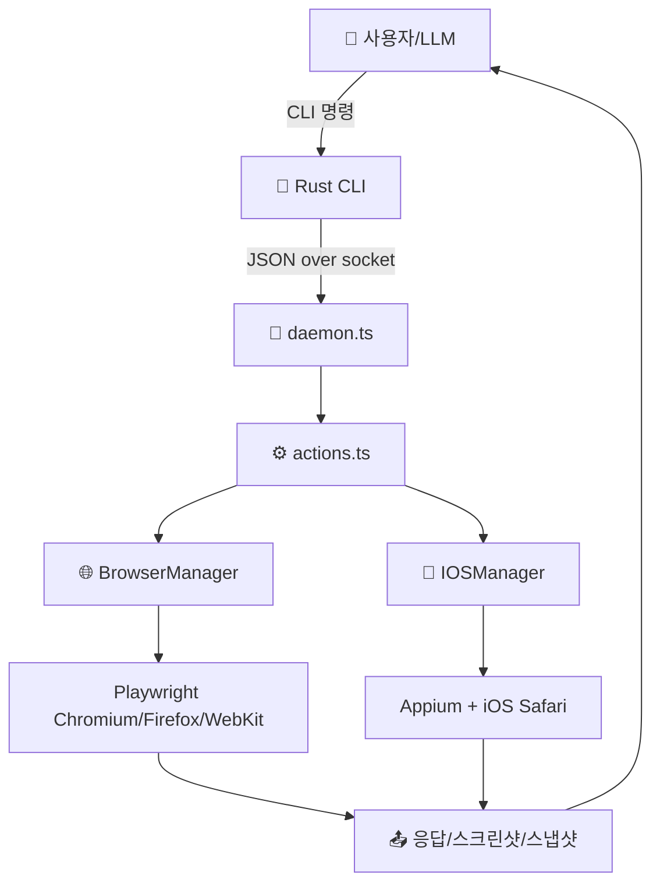

# 📖 이 시스템은 무엇인가요?

## 쉬운 설명

이 시스템은 "웹 브라우저 조종 로봇"입니다.  
사람이 브라우저를 열고, 버튼을 누르고, 텍스트를 입력하는 일을 명령어로 대신 수행합니다.

## 이 시스템이 하는 일

사용자는 `agent-browser click @e1` 같은 명령을 입력합니다.  
시스템은 내부 데몬이 이 명령을 받아 Playwright(iOS는 Appium/WebDriverIO)로 실행한 뒤 결과를 JSON으로 돌려줍니다.

## 전체 구조 다이어그램

아래 그림은 이 시스템의 큰 그림입니다. 화살표는 명령/결과 흐름입니다.



## 디렉토리 구조

각 폴더가 맡은 역할은 다음과 같습니다.

```text
agent-browser/
├── src/                       ← 브라우저 자동화 핵심 엔진 (daemon, actions, browser)
├── cli/src/                   ← 고속 Rust CLI 파서/연결기
├── docs/src/app/              ← 문서 사이트 + docs-chat API
├── skills/                    ← Codex/에이전트용 SKILL 지시문
├── test/                      ← E2E 및 통합 테스트
├── bin/                       ← 플랫폼별 바이너리 실행 래퍼
└── scripts/                   ← 빌드/배포/postinstall 스크립트
```

## 핵심 용어 설명

| 용어 | 쉬운 설명 |
|------|----------|
| 데몬 (Daemon) | 백그라운드에서 계속 켜져 명령을 받는 프로세스 |
| 에이전트 (Agent) | 특정 역할을 수행하는 AI/자동화 모듈 |
| 스냅샷 (Snapshot) | 화면 요소를 텍스트 트리 + `@e1` 참조로 만든 결과 |
| Ref (`@e1`) | 클릭/입력 대상을 안정적으로 가리키는 식별자 |
| 액션 정책 (Action Policy) | 어떤 명령을 허용/거부/확인할지 정하는 보안 규칙 |
| 워크플로우 | 요청부터 결과까지 처리 순서 |
