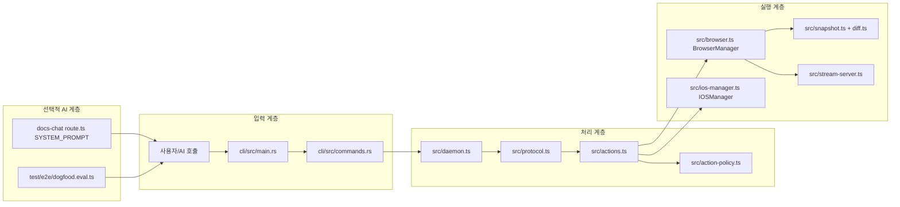
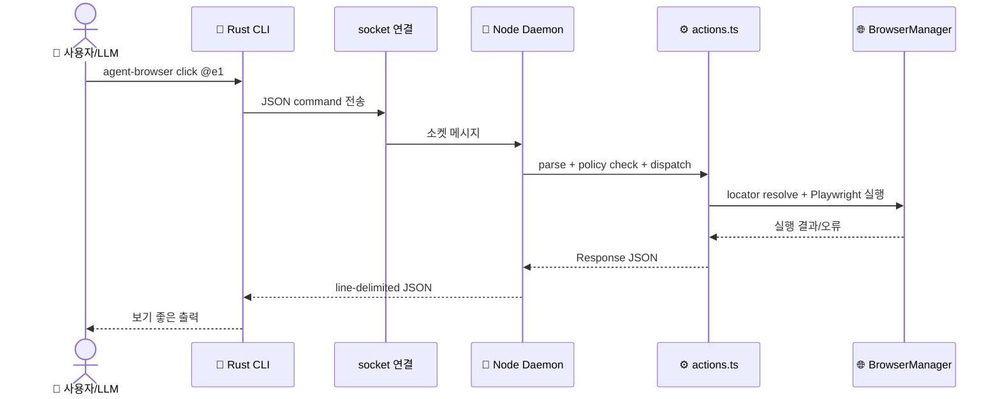

# 🏗️ 시스템 아키텍처

## 아키텍처란?

아키텍처는 시스템의 설계도입니다. 이 레포는 "CLI 계층 + 데몬 계층 + 브라우저 실행 계층"으로 나뉩니다.

## 전체 컴포넌트 구조

이 그림은 주요 컴포넌트의 연결 관계를 보여줍니다.

## 데이터 흐름

아래 시퀀스는 일반적인 명령 1건이 처리되는 흐름입니다.

## 계층별 설명

- 입력 계층: Rust CLI가 명령 문자열을 JSON 액션으로 변환합니다.
- 처리 계층: 데몬이 세션 상태를 유지하고, 정책 검사 후 액션을 라우팅합니다.
- 실행 계층: BrowserManager/IOSManager가 실제 브라우저 조작을 담당합니다.
- 선택적 AI 계층: docs-chat, dogfood eval에서 LLM이 이 도구를 활용합니다.
