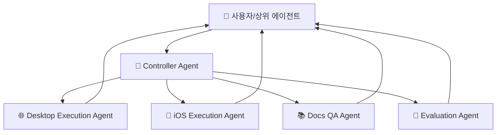

# 🤖 에이전트 구성

## 에이전트가 뭔가요?

agent-browser에서 에이전트는 "사용자 명령을 실제 브라우저/디바이스 행동으로 바꾸는 실행 담당자"입니다.
핵심은 1) 요청을 배분하는 컨트롤러와 2) 플랫폼별 실행 에이전트(Desktop/iOS)의 역할 분리입니다.

## 에이전트 관계도

아래 그림은 에이전트 관점의 책임 분담입니다.

## 에이전트별 상세 설명

### Controller Agent
- **역할**: 전체 요청 라우팅과 실행 조율
- **파일 위치**: `src/daemon.ts`
- **담당 업무**:
  - 명령 수신 및 큐잉
  - Desktop/iOS 실행 경로 선택
  - 실행 결과 통합 후 반환
- **사용 모델**: 없음 (규칙 기반 라우팅)

### Desktop Execution Agent
- **역할**: 데스크톱 브라우저 조작 담당
- **파일 위치**: `src/browser.ts`, `src/actions.ts`
- **담당 업무**:
  - 클릭/입력/스크롤/탭 제어
  - 스냅샷 및 상태 수집
  - Playwright 기반 웹 상호작용 실행
- **사용 모델**: 없음

### iOS Execution Agent
- **역할**: iOS Safari 자동화 담당
- **파일 위치**: `src/ios-manager.ts`, `src/ios-actions.ts`
- **담당 업무**:
  - 디바이스 선택/초기화
  - iOS 브라우저 동작 실행
  - 스냅샷/탭/입력 처리
- **사용 모델**: 없음

### Docs QA Agent
- **역할**: 문서 질의응답 전용 에이전트
- **파일 위치**: `docs/src/app/api/docs-chat/route.ts`
- **담당 업무**:
  - 시스템 프롬프트 기반 문서 답변 생성
  - 필요 시 파일/쉘 도구 호출
- **사용 모델**: `anthropic/claude-haiku-4.5`

### Evaluation Agent
- **역할**: 자동 평가 시나리오 실행 및 품질 확인
- **파일 위치**: `src/dogfood.eval.ts`
- **담당 업무**:
  - 대표 워크플로우 실행
  - 결과 수집 및 회귀 확인
- **사용 모델**: 시나리오 설정에 따름

## 에이전트 역할 분담표

| 에이전트 | 역할 한 줄 요약 | 입력 | 출력 | 책임 범위 |
|---------|----------------|------|------|----------|
| Controller Agent | 요청 배분과 실행 조율 | JSON command | 실행 지시/통합 결과 | 오케스트레이션 |
| Desktop Execution Agent | 데스크톱 웹 자동화 | action payload | 실행 결과/스냅샷 | 데스크톱 실행 |
| iOS Execution Agent | iOS 웹 자동화 | action payload | 실행 결과/스냅샷 | iOS 실행 |
| Docs QA Agent | 문서 기반 답변 생성 | 사용자 질문 | 텍스트 답변 | 문서 질의응답 |
| Evaluation Agent | 시나리오 기반 품질 검증 | 테스트 시나리오 | 평가 결과 | 자동 검증 |
