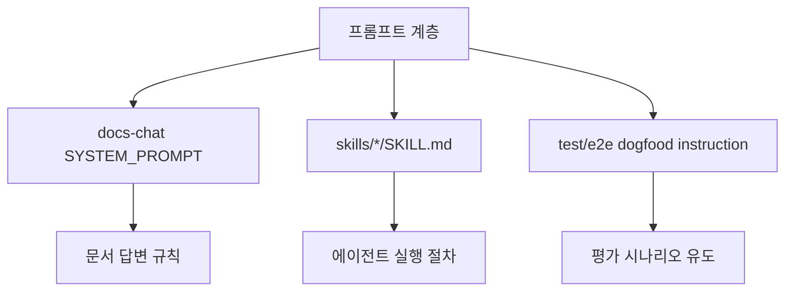
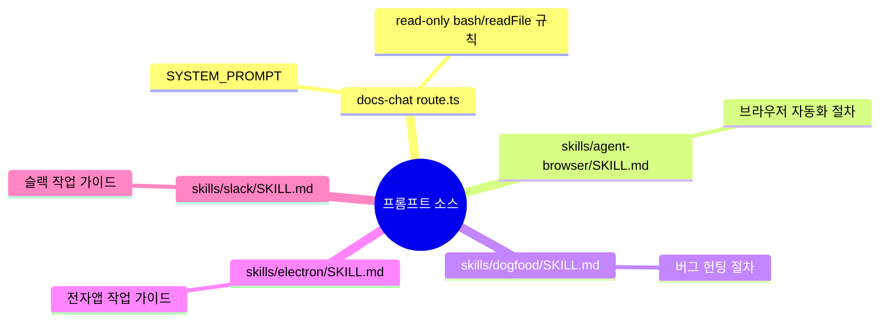
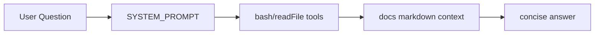

# 📝 프롬프트 분석

## 프롬프트가 뭔가요?

프롬프트는 AI에게 주는 작업 지시문입니다. 이 레포에서는 "런타임 실행 엔진"이 중심이라 프롬프트 수는 많지 않지만, 문서 챗봇과 스킬 파일에서 명확한 지시문 체계가 보입니다.

## 프롬프트 구조 개요

이 그림은 이 레포의 프롬프트 계층을 보여줍니다.

## 발견된 프롬프트 목록

## 프롬프트별 상세 분석

### docs-chat SYSTEM_PROMPT
- **위치**: `docs/src/app/api/docs-chat/route.ts`
- **용도**: 문서 기반 QA 어시스턴트 동작 제어
- **구조**: 시스템 지시문 + 툴 사용 규칙 + 금지 규칙
- **주요 인스트럭션 요약**:
  - bash로 문서 검색 가능
  - 파일 수정/삭제 금지(읽기 전용)
  - 문서 근거 기반 답변
  - 문서 밖 내용은 모른다고 답변

### dogfood eval instruction (테스트용)
- **위치**: `test/e2e/dogfood.eval.ts`
- **용도**: SDK 에이전트에게 dogfood 작업 절차를 위임
- **구조**: 문자열 템플릿 결합
- **주요 변수**: `SKILL_PATH`, `TARGET_URL`, `outputDir`

| 변수명 | 타입 | 설명 | 예시 |
|--------|------|------|------|
| `SKILL_PATH` | path | 따라야 할 지시문 파일 | `skills/dogfood/SKILL.md` |
| `TARGET_URL` | string | 테스트 대상 URL | `file:///.../buggy-app.html` |
| `outputDir` | path | 산출물 저장 위치 | `test/e2e/.dogfood-output` |

### skills/*/SKILL.md
- **위치**: `skills/agent-browser/SKILL.md` 등 4개
- **용도**: Codex/에이전트 실행 가이드
- **구조**: 트리거용 frontmatter + 단계형 지침
- **특징**: 직접적인 system/user 분리 대신 "작업 프로토콜" 형태
