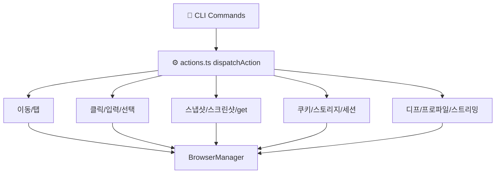
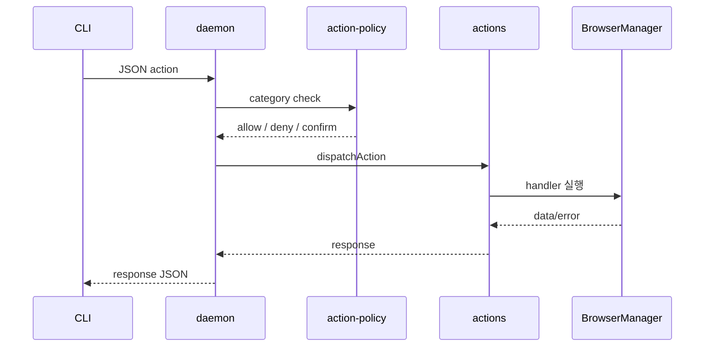

# 🛠️ 툴 & 함수

## 툴이 뭔가요?

이 레포의 "툴"은 `actions.ts`에서 처리되는 액션(command)입니다.  
사용자는 CLI 명령으로 호출하지만 내부에서는 표준화된 JSON 액션으로 실행됩니다.

## 툴 전체 맵

이 그림은 큰 툴 카테고리와 실행 대상의 관계를 보여줍니다.

## 툴 호출 흐름

아래 시퀀스는 액션 정책까지 포함한 호출 흐름입니다.

## 툴 목록 (핵심 카테고리)

| 툴/함수명 | 파일 | 설명 | 입출력 |
|---|---|---|---|
| `dispatchAction` | `src/actions.ts` | 134개 액션 라우팅 | `Command` -> `Response` |
| `handleNavigate` | `src/actions.ts` | URL 이동 + waitUntil | url -> title/url |
| `handleClick` | `src/actions.ts` | ref/selector 클릭 | selector -> clicked |
| `handleSnapshot` | `src/actions.ts` + `src/snapshot.ts` | 접근성 트리 + refs 생성 | page -> tree+refs |
| `handleScreenshot` | `src/actions.ts` | 이미지 캡처(annotate 지원) | page/selector -> file |
| `diffSnapshots` | `src/diff.ts` | 텍스트 스냅샷 diff | before/after -> unified diff |
| `diffScreenshots` | `src/diff.ts` | 픽셀 이미지 diff | image buffers -> mismatch stats |
| `checkPolicy` | `src/action-policy.ts` | 명령 허용/거부/확인 | action -> decision |
| `saveAuthProfile` | `src/auth-vault.ts` | 로그인 정보 암호화 저장 | creds -> encrypted file |
| `safeHeaderMerge` | `src/state-utils.ts` | 헤더 병합 보안 처리 | headers -> safe headers |
| `executeIOSCommand` | `src/ios-actions.ts` | iOS 액션 전용 디스패치 | command -> iOS response |
| `StreamServer` | `src/stream-server.ts` | WS 스트리밍 + 입력 주입 | frames/events |

## 툴별 상세 포인트

- 액션 표면적이 넓습니다: `dispatchAction` 기준 134개 케이스.
- `@tool` 데코레이터 방식은 사용하지 않고, 중앙 디스패처 방식으로 구현됩니다.
- 보안 제어는 `action-policy`, confirm queue, origin check(`stream-server`)로 보강되어 있습니다.
