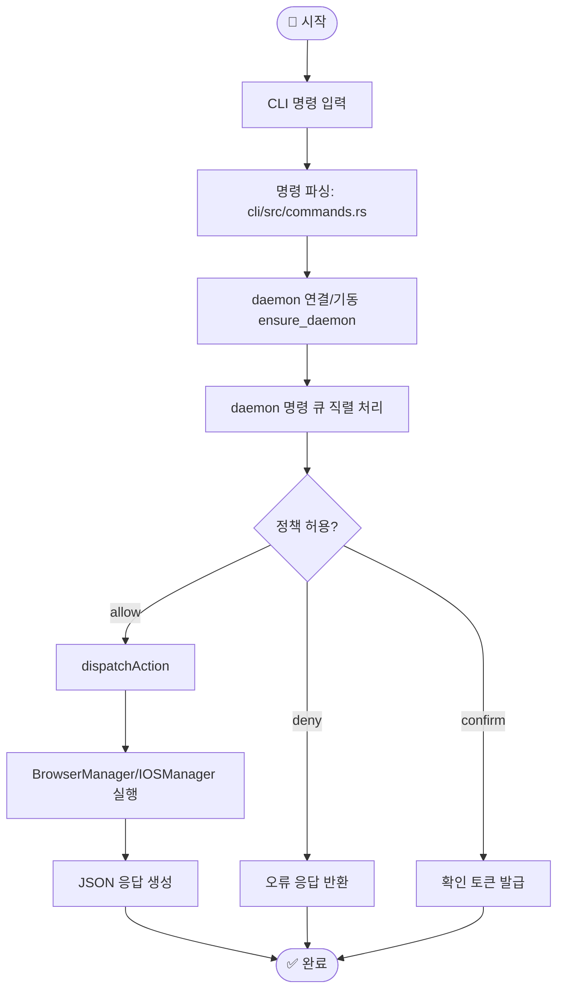
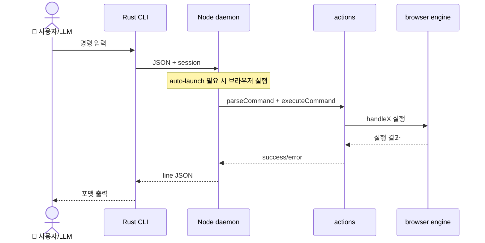
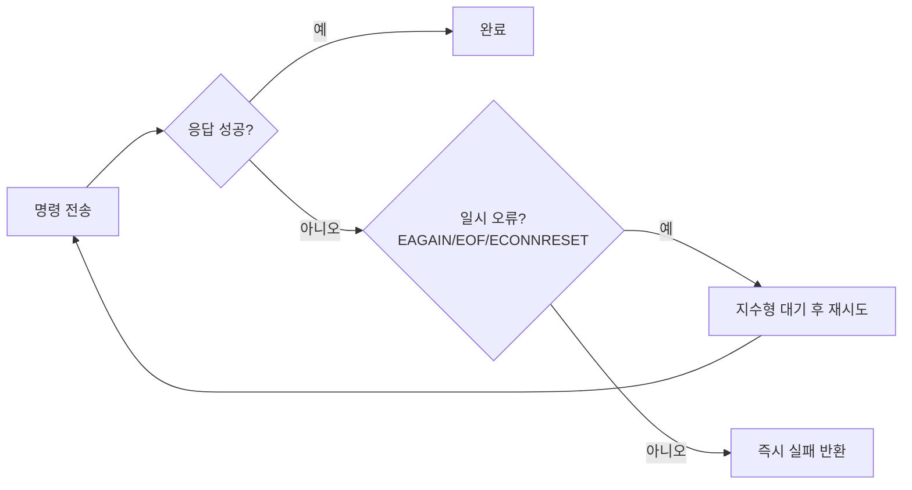

# 🔄 워크플로우

## 워크플로우가 뭔가요?

워크플로우는 "명령이 실제 결과가 되기까지의 순서"입니다. 이 레포의 핵심은 **세션 데몬 + 액션 디스패처 + 브라우저 매니저** 3단 구조입니다.

## 메인 워크플로우

이 그림은 기본 실행 경로를 보여줍니다.



## 에이전트 간 상호작용 흐름

아래 그림은 실제 실행 시퀀스입니다.



## 오류 처리 흐름

이 그림은 재시도/폴백 흐름을 보여줍니다.



## 주요 시나리오별 흐름

### 1) Snapshot-ref 루프

```mermaid
flowchart TD
    S1[snapshot -i] --> S2[@e1/@e2 refs 획득]
    S2 --> S3[click/fill 등 실행]
    S3 --> S4[DOM 변경]
    S4 --> S1
```

### 2) Docs Chat 흐름

- 사용자가 docs 질문을 보냄
- `SYSTEM_PROMPT`가 read-only 규칙을 강제
- `bash/readFile` 툴로 mdx 변환 문서를 조회
- 스트리밍 응답 반환
