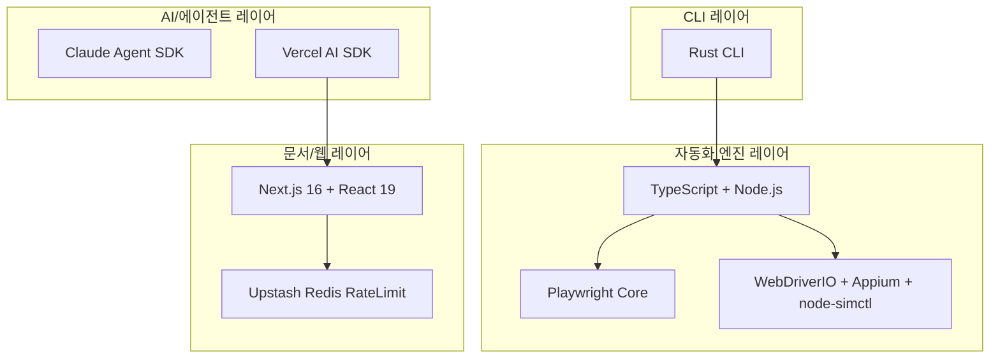
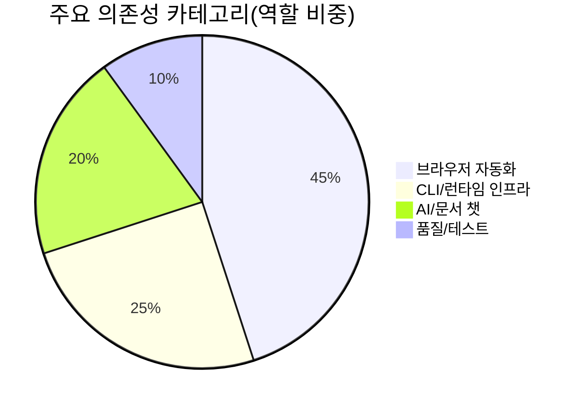

# 📦 기술 스택

## 기술 스택이 뭔가요?

이 시스템을 구성하는 언어, 라이브러리, 런타임의 조합입니다. 이 레포는 "Rust CLI + Node/TS 실행 엔진 + Playwright"가 중심입니다.

## 기술 스택 구성

이 그림은 계층별 기술 배치를 보여줍니다.

## 의존성 비중 (핵심 구성 관점)

다음 값은 패키지 개수 기준 정밀 통계가 아니라, 실제 역할 비중을 반영한 분석용 근사치입니다.

## 상세 스택

| 카테고리 | 기술/라이브러리 | 버전 | 용도 |
|---------|--------------|------|------|
| 언어/런타임 | TypeScript, Node.js | TS 5.x | 데몬/액션/자동화 구현 |
| CLI 언어 | Rust | stable (Cargo) | 초고속 명령 파싱/소켓 통신 |
| 브라우저 자동화 | `playwright-core` | `^1.57.0` | 데스크톱 브라우저 조작 |
| iOS 자동화 | `webdriverio`, `node-simctl`, Appium | `^9.15.0`, `^7.4.0` | iOS Safari 제어 |
| 스키마/검증 | `zod` | `^3.22.4` | 프로토콜 커맨드 검증 |
| 문서 앱 | Next.js, React | `16.1.1`, `19.2.3` | docs 사이트 |
| LLM 연동 | `ai`, `@ai-sdk/react` | `^6.0.78`, `^3.0.80` | docs-chat |
| LLM SDK | `@anthropic-ai/claude-agent-sdk` | `^0.2.52` | dogfood eval |
| 데이터/제한 | Upstash Redis/Ratelimit | `^1.36.2`, `^2.0.8` | docs-chat rate limit |
