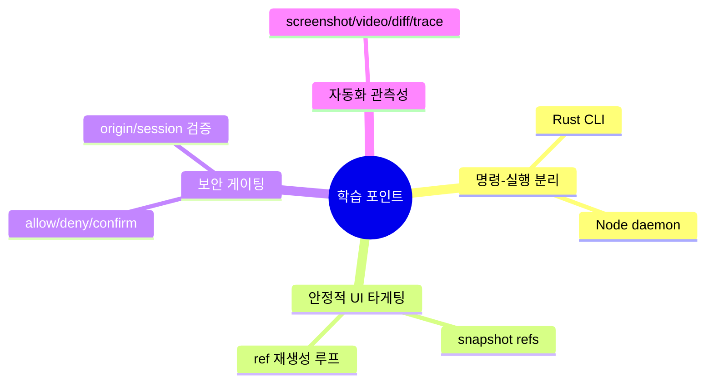

# 💡 핵심 인사이트 & 제안

## 잘 설계된 부분 👍

1. **CLI-데몬 분리 아키텍처**: Rust CLI와 Node 실행 엔진을 분리해 UX 속도와 기능 확장성을 동시에 확보했습니다.
2. **Ref 기반 상호작용**: `snapshot -> @eN -> action` 루프가 LLM 자동화 안정성을 크게 높입니다.
3. **보안 장치 내장**: action policy, confirm queue, stream origin 검증, 세션명 검증으로 공격 표면을 줄였습니다.
4. **크로스 플랫폼 전략**: 데스크톱(Playwright)과 iOS(Appium) 경로를 한 프로토콜로 통일했습니다.
5. **관찰 가능성 강화**: screenshot/video/trace/profiler/diff 도구가 디버깅과 회귀 검증에 강합니다.

## 주의해야 할 부분 ⚠️

1. **액션 수가 매우 많음(134개)**: 기능 폭은 강점이지만 문서/테스트/호환성 유지 비용이 큽니다.
2. **프롬프트 거버넌스 분산**: docs-chat prompt, skills prompt, dogfood instruction이 분산되어 버전 동기화 리스크가 있습니다.
3. **외부 의존도**: iOS 자동화(Appium/Xcode), dogfood eval(API 키/게이트웨이)은 환경에 따라 재현성이 달라질 수 있습니다.
4. **멀티 에이전트 엔진은 아님**: 이 레포는 에이전트 프레임워크라기보다 "에이전트용 실행기"이므로 기대치를 명확히 해야 합니다.

## 초보자를 위한 학습 포인트 🎓

이 레포에서 배울 수 있는 핵심 패턴입니다.

## 개선 제안 🚀

| 우선순위 | 제안 | 기대 효과 |
|---------|------|---------|
| 높음 | `actions.ts`를 카테고리별 모듈로 분리하고 자동 문서 생성(액션 스키마 기반) 도입 | 유지보수성/변경 안정성 향상 |
| 높음 | prompt 소스(docs-chat, skills, eval) 공통 정책 템플릿화 | 프롬프트 일관성 및 품질 향상 |
| 중간 | 액션 정책 기본 템플릿(`strict`, `balanced`, `open`) 제공 | 보안 설정 진입장벽 감소 |
| 중간 | iOS 경로 사전진단 커맨드(`doctor`) 강화 | 환경 문제 조기 발견 |
| 낮음 | 주요 워크플로우용 시각적 상태 대시보드(세션/큐/재시도 통계) | 운영 가시성 향상 |
