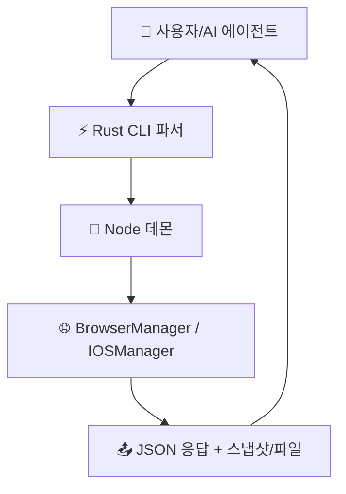

# 🔍 agent-browser 분석 보고서

> **한 줄 요약**: 이 레포는 "AI가 웹 브라우저를 손처럼 다루게 해주는 자동화 엔진"입니다.
> 분석일: 2026-03-03 | 레포: https://github.com/vercel-labs/agent-browser

## 📚 이 보고서 읽는 순서

처음 보는 분은 이 순서대로 읽으세요:

| 순서 | 파일 | 내용 | 소요 시간 |
|------|------|------|----------|
| 1 | [00_overview](mgjang_claw/[260303]agent-browser_report/00_overview/summary.md) | 전체 그림 파악 | 5분 |
| 2 | [01_architecture](mgjang_claw/[260303]agent-browser_report/01_architecture/architecture.md) | 시스템 구조 | 10분 |
| 3 | [02_agents](mgjang_claw/[260303]agent-browser_report/02_agents/agents.md) | 에이전트/모듈 역할 | 10분 |
| 4 | [03_prompts](mgjang_claw/[260303]agent-browser_report/03_prompts/prompts.md) | 프롬프트/지시문 구조 | 15분 |
| 5 | [04_tools](mgjang_claw/[260303]agent-browser_report/04_tools/tools.md) | CLI 액션/툴 체계 | 10분 |
| 6 | [05_workflows](mgjang_claw/[260303]agent-browser_report/05_workflows/workflows.md) | 실제 실행 흐름 | 15분 |
| 7 | [06_techstack](mgjang_claw/[260303]agent-browser_report/06_techstack/techstack.md) | 기술 스택 | 5분 |
| 8 | [07_insights](mgjang_claw/[260303]agent-browser_report/07_insights/insights.md) | 인사이트/개선 제안 | 10분 |

## 🗺️ 전체 구조 한눈에 보기

이 그림은 "명령 입력 → 데몬 처리 → 브라우저 실행 → 결과 반환"의 핵심 흐름을 보여줍니다.

## 📊 주요 수치

| 항목 | 수치 |
|------|------|
| 총 파일 수 | 141개 |
| 에이전트성 모듈 수 | 4개 (BrowserManager, IOSManager, Docs Chat Assistant, Dogfood Eval Agent) |
| 프롬프트/지시문 핵심 파일 수 | 5개 (docs-chat SYSTEM_PROMPT 1 + skills SKILL.md 4) |
| 정의된 액션(툴) 수 | 134개 (`dispatchAction` case 기준) |
| 사용 AI 프레임워크 | Vercel AI SDK, Claude Agent SDK |
