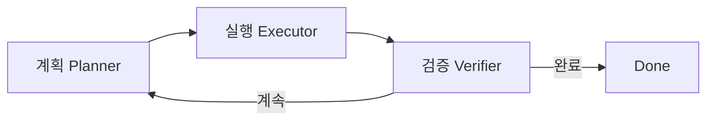
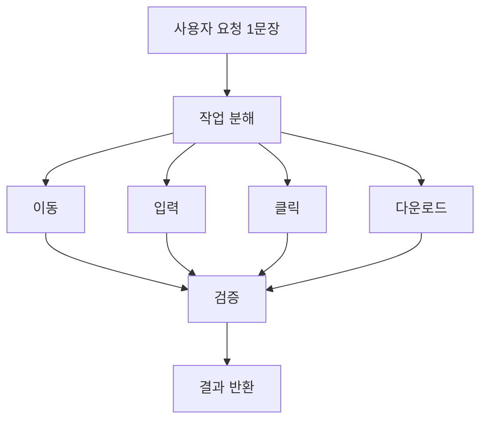

# 00. 처음 보는 사람을 위한 Agentic Workflow 입문 (7개 프로젝트판)

## 1) 한 문장 정의

- Agentic workflow는 "AI가 상황을 보고 다음 행동을 반복 결정하는 일 처리 루프"입니다.

## 2) 먼저 이것만 기억하면 됩니다

1. 계획(무엇을 할지)
2. 실행(클릭/입력/호출)
3. 검증(끝낼지/다시 할지)

## 3) 7개 프로젝트를 3가지 성격으로 단순화

| 성격 | 프로젝트 | 쉬운 해석 |
|---|---|---|
| 균형형 런타임 | browser-use | 계획-실행-검증을 한 엔진에서 균형 있게 처리 |
| 워크플로우/조율형 | skyvern, openmanus | 큰 작업을 단계로 나누고 오케스트레이션 |
| 실행기/플랫폼형 | agent-browser, openclaw | 상위 지시를 실제 액션/채널 실행으로 전환 |
| 모델/평가형 | ui-tars, opencua | 모델 출력 파싱 또는 평가 파이프라인 중심 |

## 4) 같은 요청도 내부적으로는 여러 스텝

예시 요청: "로그인해서 최신 인보이스 PDF 받아줘"

1. 페이지 이동
2. 아이디/비번 입력
3. 로그인 클릭
4. 인보이스 화면 탐색
5. 다운로드
6. 파일 검증

## 5) 초보자 체크리스트

1. 이 시스템은 반복 루프가 있는가?
2. 액션은 어디서 정의되는가? (`tool`, `action`, `block`)
3. 실패 시 복구 규칙이 있는가? (`retry`, `terminate`, `policy`)
4. 완료 판정이 있는가? (`done`, `judge`, `completion`)
5. 상태/히스토리를 누적하는가?

## 6) 지금 이 비교 문서를 읽는 목적

- 7개 프로젝트의 코드 스타일이 달라도, 역할(계획/실행/검증) 기준으로는 같은 구조라는 점을 익히는 것입니다.
- 이 기준이 잡히면 새 프로젝트를 보더라도 빠르게 해석할 수 있습니다.
