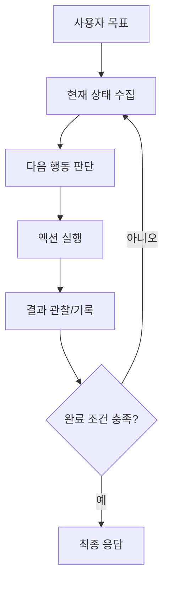
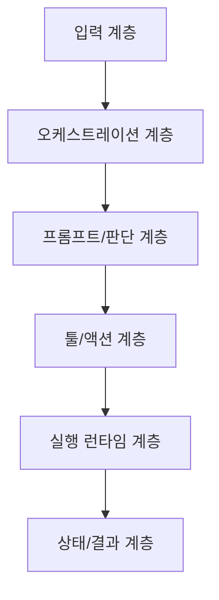

# 01. 공통 Agentic Workflow 패턴 (7개 프로젝트 공통축)

## 공통 골격

이름이 달라도 핵심 루프는 같습니다.

## 6단계 공통 해석

| 단계 | 공통 의미 | 실패 포인트 |
|---|---|---|
| 목표 수신 | 자연어를 실행 가능한 task로 변환 | 목표가 모호하면 루프가 흔들림 |
| 상태 수집 | 페이지/세션/히스토리 확인 | 오래된 상태로 잘못 판단 |
| 계획/판단 | 다음 action 또는 block 결정 | 포맷 오류, 잘못된 라우팅 |
| 실행 | 실제 클릭/입력/호출 수행 | 요소 미발견, 타임아웃 |
| 기록 | 결과를 상태에 누적 | 로그 누락으로 품질 하락 |
| 종료 판정 | done/failed/terminate 분기 | 조기 종료 또는 무한 반복 |

## 프로젝트별 같은 자리 매핑

| 공통 자리 | browser-use | skyvern | agent-browser | openmanus | ui-tars | openclaw | opencua |
|---|---|---|---|---|---|---|---|
| 판단 주체 | Agent/CodeAgent | TaskV2 Planner | Controller/외부 호출자 | Manus/PlanningFlow | UI-TARS 모델 | Main Agent | run.py router + 모델 agent |
| 실행 주체 | Tools.act | ForgeAgent/ActionHandler | dispatchAction | ToolCollection | action_parser + pyautogui | Tools/Plugins/Nodes | parsed action evaluator path |
| 검증/종료 | Judge/done | completion check | 결과 코드/policy | terminate/max_steps | 포맷/실행 성공 여부 | 채널 응답/세션 상태 | eval.py metric |

## 공통 계층 구조

## 초보자 관찰 포인트

1. "누가 계획하나"를 먼저 찾습니다.
2. "누가 실제 액션을 실행하나"를 분리해서 봅니다.
3. "누가 종료를 판정하나"를 마지막에 확인합니다.
4. 이 3개만 찾으면 대부분의 레포는 빠르게 구조가 보입니다.
