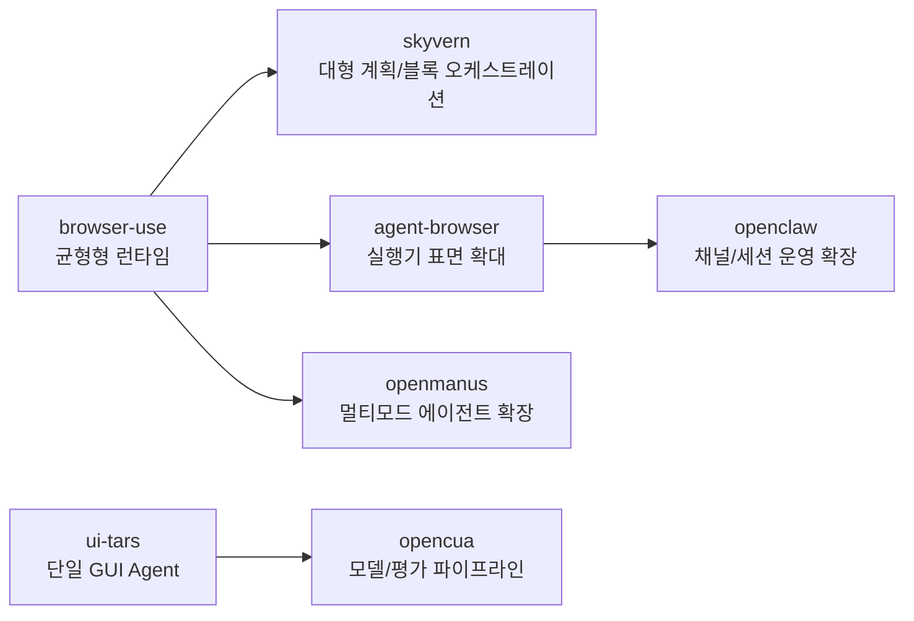
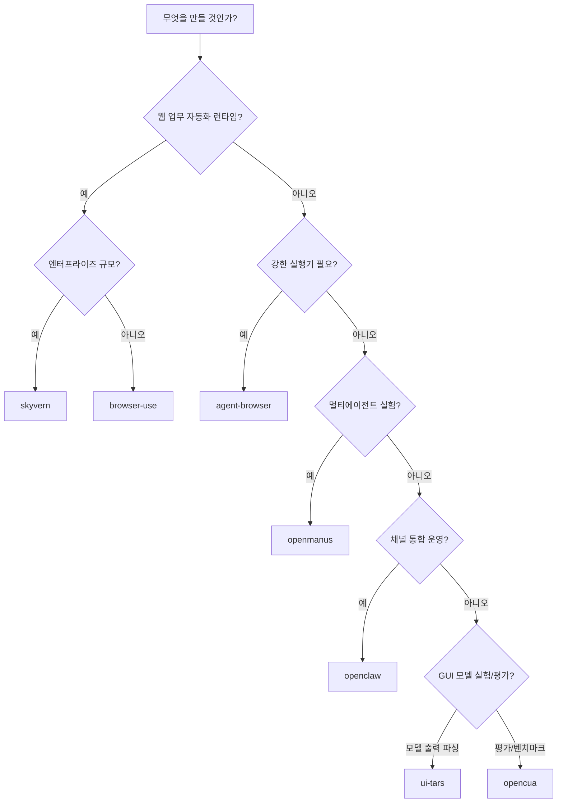

# 02. 차이점 비교 (7개 프로젝트)

## 정량 비교 표

| 항목 | browser-use | skyvern | agent-browser | openmanus | ui-tars | openclaw | opencua |
|---|---:|---:|---:|---:|---:|---:|---:|
| 총 파일 수 | 524 | 2,439 | 141 | 145 | 28 | 7,277 | 152 |
| 프롬프트 규모 | 18 | 77 | 5 | 8 | 1 | 96 | 코드상 19+ |
| 툴/액션 표면 | 26 | 22 + MCP34 | 134 | 13 + 확장 | 15 | 코어 25 | 인터페이스 13 |
| 운영 포지션 | 런타임 | 워크플로우 엔진 | 실행기 | 멀티에이전트 프레임 | GUI 모델 파서 | 채널 기반 OS | 데이터/모델/평가 프레임 |

## 구조 차이를 한 장으로

## 어떤 부분이 두꺼운가

| 프로젝트 | 두꺼운 레이어 | 설명 |
|---|---|---|
| browser-use | 런타임 루프 | 계획-실행-검증 밸런스 |
| skyvern | 오케스트레이션 | TaskV2 + Workflow 블록 체계 |
| agent-browser | 실행 엔진 | 134개 액션, 데스크톱/iOS 실행 |
| openmanus | 역할 분리 | Manus + 특화 에이전트 + flow |
| ui-tars | 모델 출력 파싱 | Action 문자열 -> 실행 코드 변환 |
| openclaw | 운영/채널 통합 | Main/Worker/Specialist + Gateway |
| opencua | 연구 파이프라인 | 데이터 생성-모델-평가 통합 |

## 선택 트리

## 핵심 차이 한 줄 요약

- `browser-use`: 가장 학습 친화적인 기준 런타임
- `skyvern`: 대규모 워크플로우/운영 통합
- `agent-browser`: 고성능 실행기 컴포넌트
- `openmanus`: 에이전트 역할 확장 실험에 유리
- `ui-tars`: 단일 GUI 액션 파서 구조가 명확
- `openclaw`: 실제 채널 운영/세션 제어에 강함
- `opencua`: 모델 품질 개선을 위한 데이터-평가 구조가 강함
