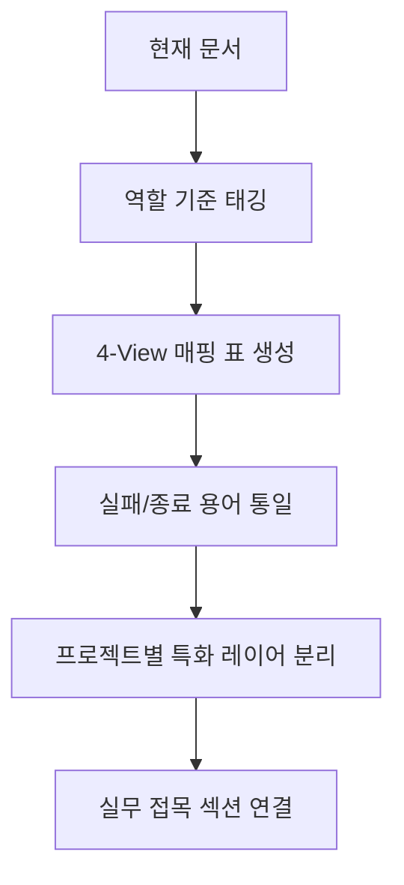

# 03. browser-use 기준 재정리 가이드 (7개 프로젝트 적용)

목표:
- `browser-use`를 기준축으로 두고 6개 프로젝트를 같은 눈금으로 재배치합니다.
- "모듈 이름"보다 "역할 이름(계획/실행/검증)"으로 문서를 읽게 만듭니다.

## 기준 축 (4-View)

## 7개 프로젝트 매핑

| 프로젝트 | View-1 Planner | View-2 Prompt | View-3 Tool/Action | View-4 Reliability |
|---|---|---|---|---|
| browser-use | Agent/CodeAgent | system_prompts | Registry/Tools.act | Watchdog/Judge |
| skyvern | TaskV2/WorkflowService | PromptEngine(Jinja2) | ActionHandler/Blocks | completed/failed/terminated |
| agent-browser | daemon/controller | docs-chat + skills | dispatchAction + managers | policy/confirm/retry |
| openmanus | Manus/PlanningFlow | app/prompt 역할 분리 | ToolCollection + MCP/sandbox | max_steps/terminate |
| ui-tars | 단일 모델 추론 | prompt.py 템플릿 | action_parser + pyautogui | 포맷 규약 검증 |
| openclaw | Main/Worker/Specialist | prompt/system 문서군 | tool-catalog + plugins | 세션/권한/채널 정책 |
| opencua | run.py model router | 에이전트별 상수 프롬프트 | parsed actions 인터페이스 | evaluator 점수 기준 |

## 재정리 절차

1. 각 프로젝트에서 Planner, Executor, Verifier 파일을 1개씩 먼저 지정
2. 액션 정의 파일(`tools`, `actions`, `blocks`)을 하나의 표로 통일
3. 실패 처리 용어를 통일 (`retry`, `failed`, `terminate`)
4. 완료 판정 로직을 별도 박스로 분리
5. 마지막에 "실무 적용 시 어디에 꽂는지"를 추가

## 재정리 후 기대 효과

- 같은 질문으로 7개 프로젝트를 비교할 수 있습니다.
- 신규 프로젝트가 추가되어도 4-View 표에 행만 추가하면 됩니다.
- 초보자가 모듈명에 막히지 않고 역할 중심으로 구조를 이해할 수 있습니다.
