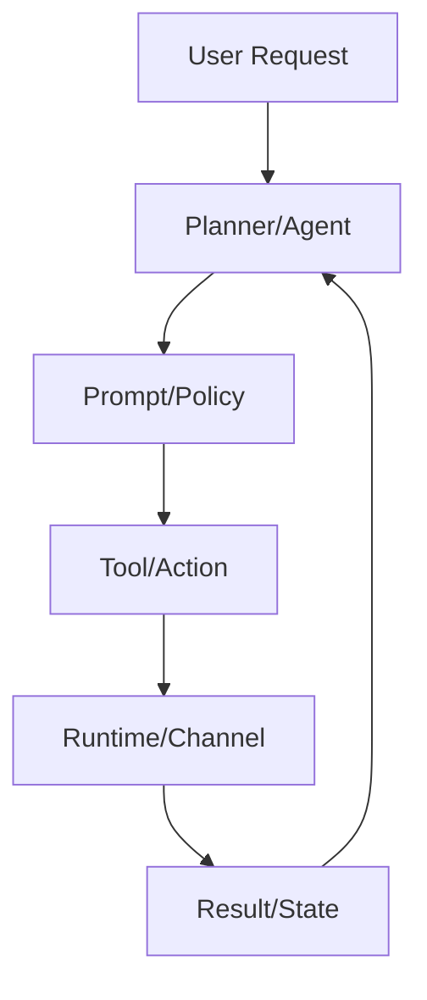

# 04. 용어 사전 (초보자용, 7개 프로젝트 공통)

## 빠른 용어 지도

## 핵심 용어

| 용어 | 쉬운 설명 | 예시 프로젝트 |
|---|---|---|
| Agent | 다음 행동을 결정하는 실행 주체 | browser-use `Agent`, openmanus `Manus` |
| Planner | 큰 목표를 작은 스텝으로 쪼개는 주체 | skyvern `TaskV2`, openmanus `PlanningFlow` |
| Executor | 실제 클릭/입력/호출을 수행하는 주체 | agent-browser `dispatchAction`, skyvern `ForgeAgent` |
| Prompt | 모델에 주는 지시문 묶음(규칙+맥락) | skyvern Jinja2, ui-tars prompt 템플릿 |
| Tool/Action | 실제 기능 호출 단위 | browser-use 26개, agent-browser 134개 |
| Workflow | 여러 스텝의 순서/분기 규칙 | skyvern block workflow, openclaw session flow |
| State | 진행 상태/히스토리/세션 데이터 | browser_state, task/step, session_id |
| Policy | 위험 액션 통제 규칙 | agent-browser confirm, openclaw 권한 정책 |
| Done/Complete | 목표 성공 종료 | done/judge/completed |
| Terminate/Failed | 불가/오류 종료 | terminate/failed/status code |
| Artifact | 실행 중 생성한 결과물 | 다운로드 파일, 로그, 스냅샷, 평가 리포트 |

## 헷갈리기 쉬운 단어

| 단어쌍 | 차이 |
|---|---|
| Prompt vs Task | Prompt는 지시 템플릿, Task는 실제 사용자 목표 |
| Tool vs Workflow | Tool은 단일 기능, Workflow는 순서/분기 |
| Retry vs Loop | Retry는 실패 복구, Loop는 정상 반복 |
| Done vs Terminate | Done은 성공 종료, Terminate는 불가 종료 |

## 프로젝트별로 읽을 때 포인트

1. `Planner`를 먼저 찾으면 구조가 잡힙니다.
2. `Action/Tool` 파일을 찾으면 실행 범위가 보입니다.
3. `Judge/Completion`을 찾으면 운영 안정성 수준이 보입니다.
4. `State` 정의를 보면 디버깅 난이도를 예측할 수 있습니다.
