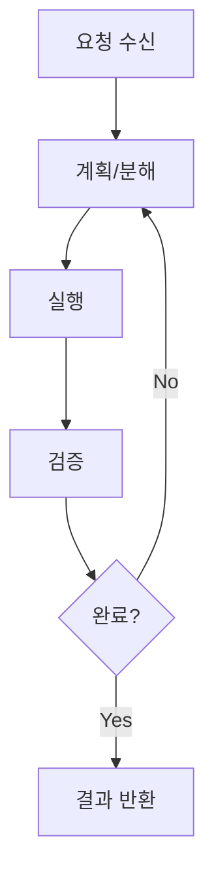
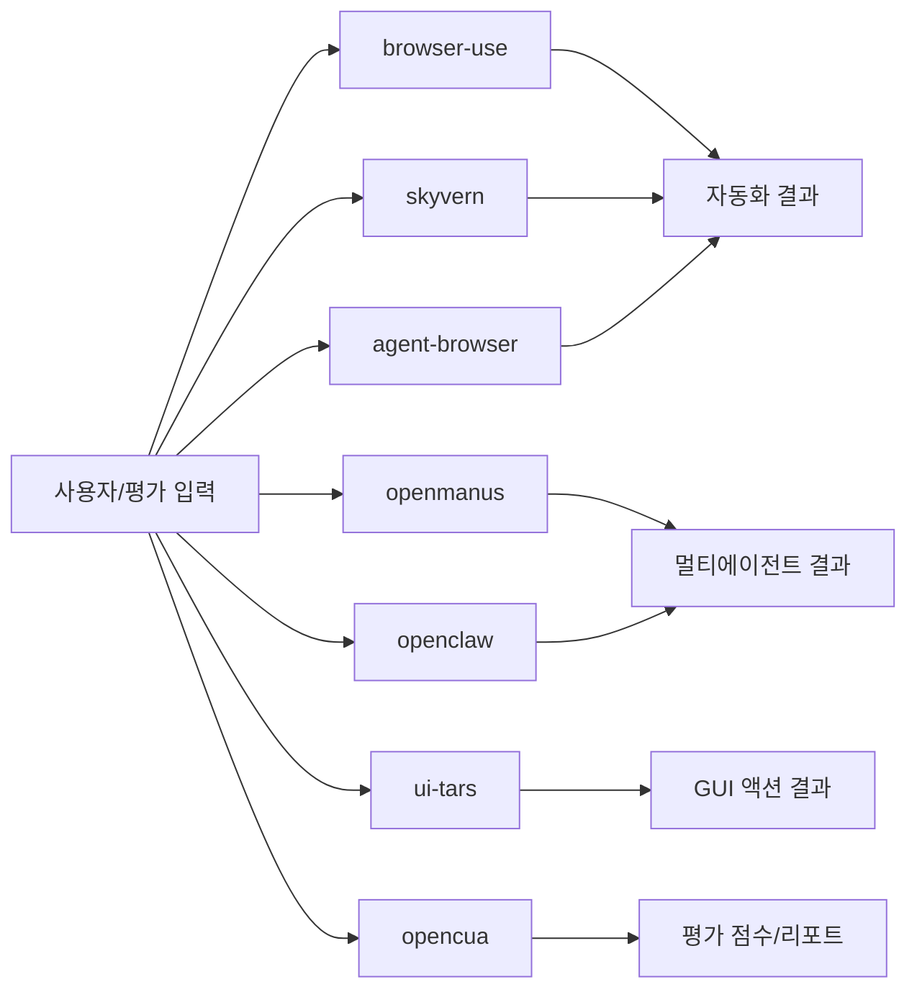

# 05. 시나리오로 보는 단계별 실행 (7개 프로젝트)

기준 요청:
- "로그인 후 최신 인보이스 PDF를 저장하고 요약해줘"

## 공통 단계 프레임

## 시나리오 A: 웹 자동화 중심 (browser-use, skyvern, agent-browser)

| 단계 | browser-use | skyvern | agent-browser |
|---|---|---|---|
| 계획 | Agent 내부 추론 | TaskV2 Planner | 외부 오케스트레이터/CLI |
| 실행 | Tools.act | ForgeAgent + ActionHandler | dispatchAction |
| 검증 | Judge | completion check | policy/result code |
| 강점 | 균형형 루프 | 대형 워크플로우 | 고성능 실행기 |

## 시나리오 B: 멀티에이전트/플랫폼 운영 (openmanus, openclaw)

| 단계 | openmanus | openclaw |
|---|---|---|
| 계획 | Manus 또는 PlanningFlow | Main Agent가 작업 분해 |
| 실행 | ToolCollection + 특화 에이전트 | Worker/Specialist 위임 + Tools |
| 검증 | terminate/max_steps | 세션/채널 응답 및 정책 |
| 강점 | 역할별 에이전트 확장 | 채널 통합 운영 |

## 시나리오 C: 모델 출력/평가 파이프라인 (ui-tars, opencua)

| 단계 | ui-tars | opencua |
|---|---|---|
| 계획 | 단일 모델 추론 | model router로 에이전트 선택 |
| 실행 | action_parser -> pyautogui | parsed actions -> evaluator |
| 검증 | 포맷/실행 성공 여부 | benchmark metric |
| 강점 | 단순한 GUI 행동 변환 | 데이터-모델-평가 통합 |

## 7개 프로젝트를 한 그림으로

## 실패가 났을 때 공통 대응

1. 일시적 실패: 제한 재시도
2. 정책/권한 실패: 즉시 차단 또는 승인 요청
3. 목표 불가: terminate/failed로 종료
4. 반복 실패: replan 또는 fallback 모드 전환

## 초보자 읽기 순서

1. 이 문서의 표부터 보고
2. `04_terms_dictionary.md`로 용어 확인
3. `02_differences.md`에서 구조 차이 확인
4. `08_enterprise_adoption.md`로 실무 적용 연결
