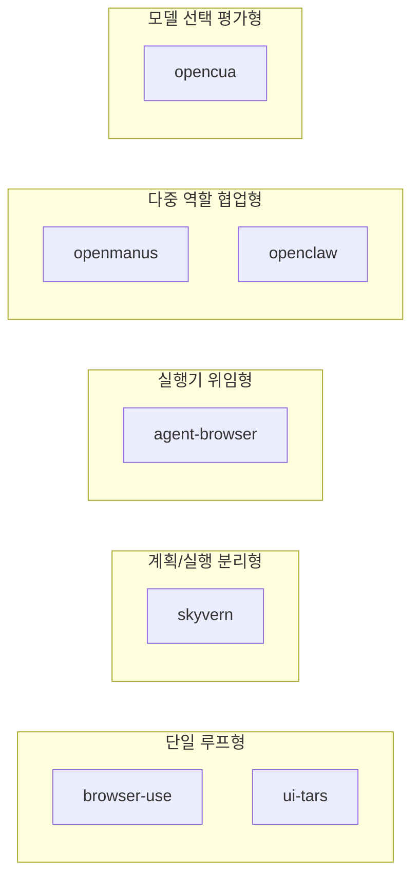
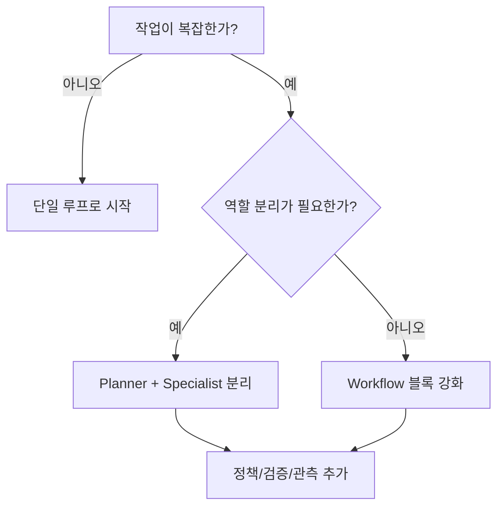

# 06. Multi-Agent & Orchestration 정리 (역할 경계 명확판)

기준일: 2026-03-03

## 한 줄 결론

- 7개 프로젝트는 모두 에이전트처럼 보이지만, 실제로는 아래 5가지 구조로 나뉩니다.

1. 단일 루프형: `browser-use`, `ui-tars`
2. Planner/Executor 분리형: `skyvern`
3. 실행기 위임형: `agent-browser`
4. 다중 역할 협업형: `openmanus`, `openclaw`
5. 모델 선택 평가형: `opencua`

## 역할 경계 지도

## 프로젝트별 "누가 무엇을 하는가"

| 프로젝트 | 계획 담당 | 실행 담당 | 검증/종료 담당 | 핵심 포인트 |
|---|---|---|---|---|
| browser-use | Agent/CodeAgent | Tools.act | Judge/done | 단일 루프 + 검증 분리 |
| skyvern | TaskV2 | ForgeAgent/ActionHandler | completion check | Planner/Executor 2계층 |
| agent-browser | 외부 오케스트레이터/Controller | dispatchAction + managers | policy/result | 브레인 외부, 실행 내부 |
| openmanus | Manus/PlanningFlow | ToolCollection + 특화 에이전트 | terminate/max_steps | 에이전트 풀 라우팅 |
| ui-tars | 단일 모델 추론 | action_parser + pyautogui | 형식/실행 확인 | 단일 GUI 에이전트 |
| openclaw | Main Agent | Worker/Specialist + tools | 세션/정책/채널 응답 | 운영형 멀티에이전트 |
| opencua | run.py model router | 선택된 단일 agent parser | evaluator | 협업형이 아닌 선택형 |

## 초보자용 오해 방지

- 에이전트 수가 많다고 항상 멀티에이전트 협업 구조는 아닙니다.
- `opencua`는 에이전트 3개가 동시에 협업하는 구조가 아니라, 실행마다 1개 선택형입니다.
- `agent-browser`는 자체 플래너보다 실행기 역할이 핵심입니다.

## 멀티에이전트 도입 판단 기준

## 실무 적용 전 체크리스트

1. 역할 충돌이 없는지 (Planner와 Executor 책임 분리)
2. 종료 조건이 명확한지 (done, failed, terminate)
3. 정책 게이트가 있는지 (승인/거부/감사 로그)
4. 장애 복구 경로가 있는지 (retry, replan, fallback)
