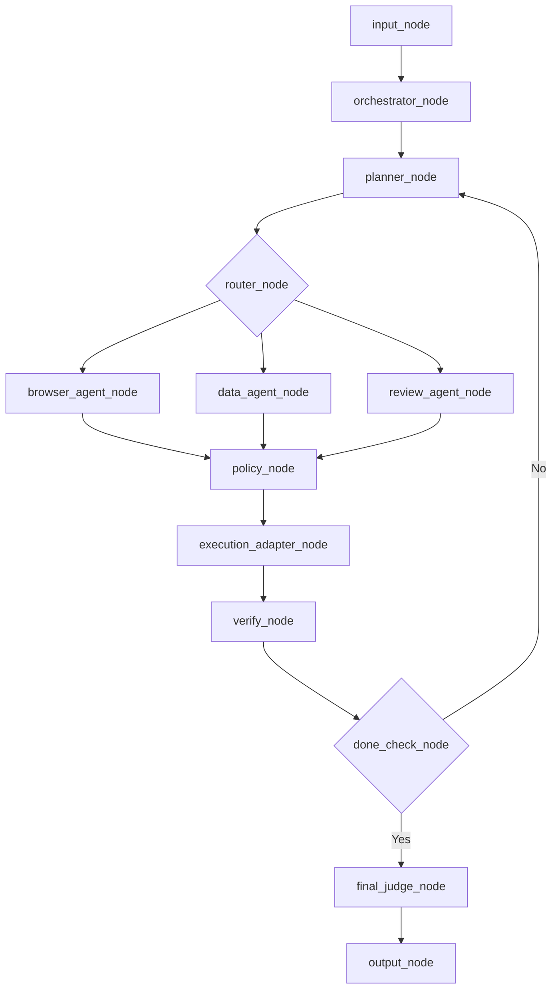
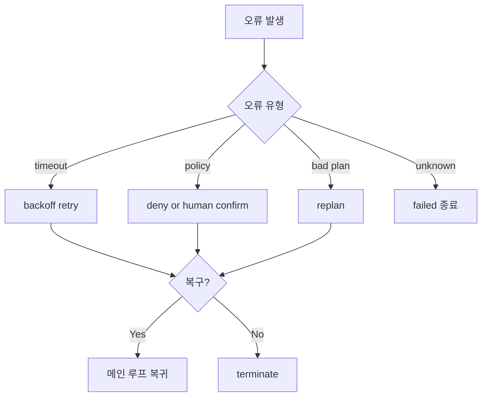

# 07. LangGraph Orchestrator 설계 가이드 (7개 프로젝트 접목)

대상: 초보자 ~ 실무 도입팀

## 설계 원칙

- 중앙 조율(Orchestrator)과 실행기(Execution Adapter)를 분리합니다.
- 에이전트 책임은 `계획`, `실행`, `검증`으로 명확히 나눕니다.
- 고위험 액션은 반드시 policy 게이트를 통과시킵니다.

## 권장 기준 아키텍처



## 7개 프로젝트에서 가져올 핵심

| 소스 | 가져올 것 | LangGraph 반영 |
|---|---|---|
| browser-use | 안정적인 step loop + judge | `verify_node`, `final_judge_node` |
| skyvern | task_type 기반 계획/블록 | `planner_node` + enum 라우팅 |
| agent-browser | 실행기 분리 + policy/confirm | `execution_adapter_node`, `policy_node` |
| openmanus | 에이전트 풀 + executor 선택 | `router_node`에서 role 기반 분기 |
| ui-tars | 단순한 액션 출력 계약 | 액션 스키마 표준화 |
| openclaw | 운영형 세션/채널 제어 | `session_id`, channel context state |
| opencua | 평가 기준 분리 | offline eval/benchmark 파이프라인 |

## 상태 스키마 최소안

```python
from typing import TypedDict, Literal, List, Dict, Any

class AgentState(TypedDict, total=False):
    user_goal: str
    run_id: str
    session_id: str
    current_task_type: Literal["navigate", "extract", "act", "analyze", "review"]
    plan_steps: List[Dict[str, Any]]
    current_step_index: int
    observations: List[Dict[str, Any]]
    artifacts: List[Dict[str, Any]]
    policy_decision: Literal["allow", "deny", "confirm"]
    retry_count: int
    consecutive_failures: int
    run_status: Literal["running", "completed", "failed", "terminated"]
    final_answer: str
```

## 구현 단계 (권장 순서)

1. 단일 루프(`planner -> browser_agent -> verify`)부터 안정화
2. `policy_node` 추가 (allow/deny/confirm)
3. `data_agent` 추가 후 `router_node` 분기
4. `final_judge_node` 추가
5. observability(로그/KPI) 연결

## 실패 복구 기본 흐름



## 최소 운영 지표

- 성공률(`completed / total`)
- 평균 처리시간(P50, P95)
- 재시도율/반복루프율
- 정책 거부율/승인 대기시간
- 종료코드 분포(`completed`, `failed`, `terminated`)
