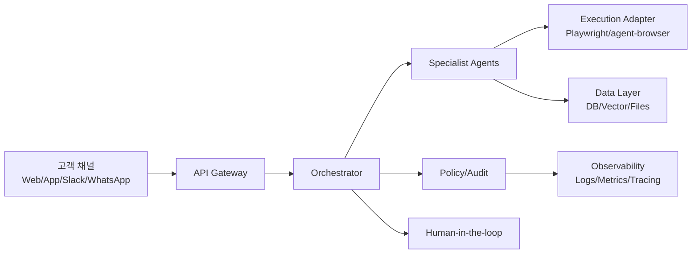
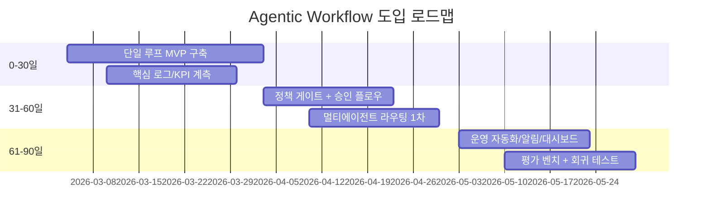

# 08. 현업 접목 세션: Agentic Workflow 도입 가이드

목표:
- 7개 프로젝트 비교 결과를 실제 팀/서비스에 바로 적용할 수 있게 정리합니다.

## 1) 도입 기준 아키텍처

## 2) 어떤 프로젝트를 어디에 접목할까

| 실무 목표 | 1순위 참고 | 2순위 참고 | 이유 |
|---|---|---|---|
| 웹 업무 자동화 PoC | browser-use | agent-browser | 빠른 구축 + 강한 실행기 연계 |
| 대규모 반복업무 운영 | skyvern | openclaw | 워크플로우/운영 체계 강화 |
| 멀티에이전트 실험 | openmanus | browser-use | 역할 분리와 단계 확장 용이 |
| 데스크톱 GUI 자동화 | ui-tars | agent-browser | 액션 파싱 + 실행 연결 |
| 모델 품질 평가/개선 | opencua | openmanus | 평가 루프 + 실험 확장 |
| 채널 통합 업무봇 | openclaw | skyvern | 멀티채널 + 정책/세션 운영 |

## 3) 팀 역할 분담 (RACI 축약)

| 영역 | 책임팀 |
|---|---|
| Orchestrator/Agent 설계 | AI Platform |
| Tool/Adapter 구현 | Automation Engineering |
| 정책/보안/감사 | Security/Compliance |
| 운영 모니터링/KPI | SRE + Product Ops |
| 프롬프트/품질 튜닝 | Applied AI |

## 4) 30/60/90일 전개 로드맵

## 5) KPI와 ROI 기본식

| KPI | 정의 |
|---|---|
| Task Success Rate | 성공 완료 건수 / 전체 실행 건수 |
| Human Handoff Rate | 사람 개입 전환 건수 / 전체 실행 건수 |
| Avg Resolution Time | 요청당 평균 완료 시간 |
| Retry Rate | 재시도 발생 건수 / 전체 step 수 |
| Policy Violation Rate | 정책 위반 건수 / 전체 액션 수 |

ROI 간단식:
- `월 절감시간(시간) x 인건비 단가 - 운영비(모델+인프라+운영)`

## 6) 리스크 통제 체크리스트

1. 고위험 액션(`submit`, `delete`, `payment`)은 무조건 confirm
2. 세션 격리(`session_id`)와 감사 로그(`who/when/what`) 저장
3. 실패 3회 연속 시 자동 terminate + human handoff
4. 프롬프트/툴 버전 고정 후 점진 배포
5. 주간 회귀 시나리오(골든 태스크)로 품질 감시

## 7) 바로 실행 가능한 시작안

1. `browser-use` 기준 단일 루프 MVP 2주
2. `agent-browser` 실행 어댑터 연동 1주
3. `openmanus` 스타일 라우팅 추가 2주
4. `skyvern` 스타일 운영 대시보드/상태코드 도입 2주
5. `opencua` 스타일 평가 루프를 QA 파이프라인에 추가

한 줄 결론:
- "작게 시작(단일 루프) -> 안전장치 추가(policy) -> 역할 분리(멀티에이전트) -> 운영/평가 자동화" 순서가 가장 실패 확률이 낮습니다.
