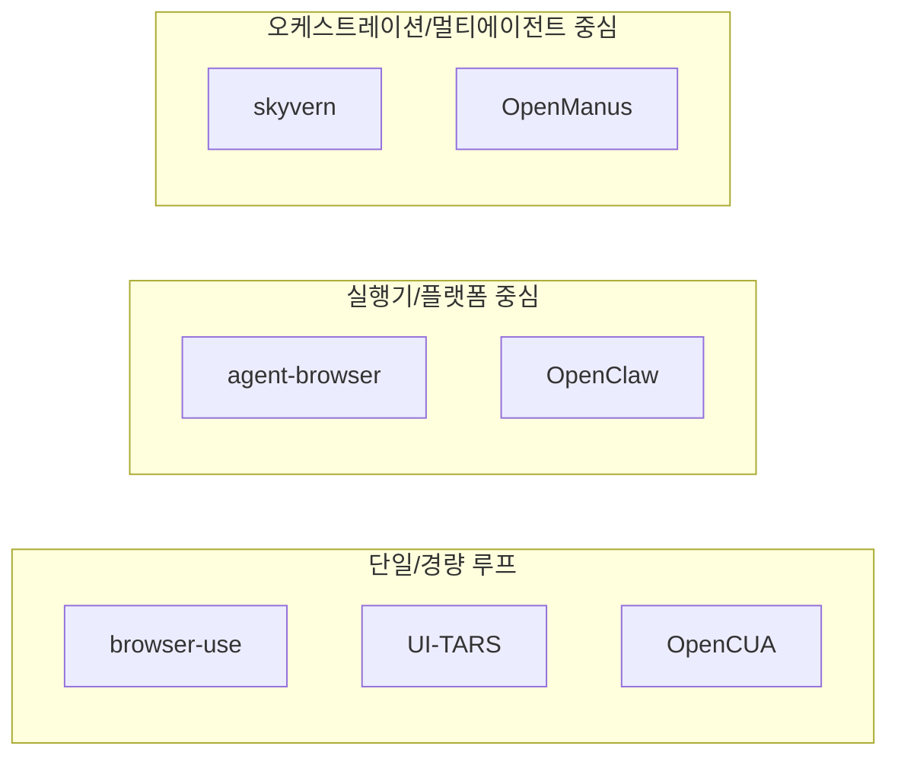

# Agentic Workflow 비교 리포트 (7개 프로젝트 통합판)

기준일: 2026-03-03

비교 대상:
- `[260303]browser-use_report`
- `[260303]skyvern_report`
- `[260303]agent-browser_report`
- `[260303]openmanus_report`
- `[260303]ui-tars_report`
- `[260303]openclaw_report`
- `[260303]opencua_report`

## 이 문서의 목표

- 7개 프로젝트를 같은 좌표계로 비교합니다.
- 초보자가 "누가 계획하고, 누가 실행하고, 누가 검증하는지"를 한 번에 이해하게 합니다.
- 마지막에는 바로 적용 가능한 **현업 접목 세션**을 제공합니다.

## 먼저 읽는 순서

1. `00_beginner_first.md`
2. `04_terms_dictionary.md`
3. `01_common_patterns.md`
4. `02_differences.md`
5. `05_step_by_step_scenarios.md`
6. `06_multi_agent.md`
7. `07_langgraph_orchestrator_multi_agent_guide.md`
8. `08_enterprise_adoption.md` (현업 접목 세션)
9. `03_reorg_guide_from_browser_use.md`

## 한눈에 비교 지도

## 핵심 수치 비교

| 항목 | browser-use | skyvern | agent-browser | openmanus | ui-tars | openclaw | opencua |
|---|---:|---:|---:|---:|---:|---:|---:|
| 총 파일 수 | 524 | 2,439 | 141 | 145 | 28 | 7,277 | 152 |
| 에이전트 구조 | 2+Judge | Planner/Executor/Workflow | Controller+Execution | 다중 역할 에이전트 풀 | 단일 GUI Agent | Main/Worker/Specialist | 모델별 단일 선택형 |
| 프롬프트 규모 | 18 | 77 | 5 | 8 | 1 | 96 | 코드상 19+ |
| 액션/툴 표면 | 26 | 22 + MCP 34 | 134 | 13 + 확장 | 15 | 코어 25 | 인터페이스 13 |
| 대표 강점 | 균형형 런타임 | 대형 워크플로우 | 고성능 실행기 | 멀티모드 확장 | GUI 파싱 단순성 | 멀티채널 운영 | 데이터-모델-평가 통합 |

## 어떤 프로젝트를 먼저 참고할까

- 빠른 PoC 시작: `browser-use`
- 엔터프라이즈 워크플로우: `skyvern`
- 강한 실행 엔진 필요: `agent-browser`
- 멀티에이전트 실험: `openmanus`
- 데스크톱/모바일 GUI 조작: `ui-tars`
- 메시징 채널 통합 자동화: `openclaw`
- CUA 모델 평가/학습 파이프라인: `opencua`

## 현업 접목 바로가기

- `08_enterprise_adoption.md`에 아래를 정리했습니다.
- 도입 아키텍처
- 팀 역할 분담(RACI)
- 30/60/90일 전개 로드맵
- KPI/ROI/리스크 통제 체크리스트
