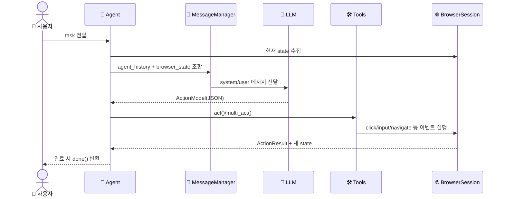

# 🏗️ 시스템 아키텍처

## 아키텍처란?

아키텍처는 "어떤 부품이 어떻게 협력하는지"를 보여주는 설계도입니다.  
`browser-use`는 크게 **오케스트레이션(Agent)**, **실행(Tools/BrowserSession)**, **모델(LLM)** 세 레이어로 나뉩니다.

## 전체 컴포넌트 구조

이 그림은 핵심 모듈 간 책임 분리를 보여줍니다.

```mermaid
graph LR
    subgraph Input
        U[👤 User Task]
        C[CLI/MCP/API 입력]
    end

    subgraph Orchestration
        A[Agent]
        CA[CodeAgent]
        MM[MessageManager]
    end

    subgraph Intelligence
        SP[SystemPrompt Templates]
        LLM[LLM Providers]
        AO[AgentOutput/ActionModel]
    end

    subgraph Execution
        TR[Tools Registry]
        TS[Tools Service]
        BS[BrowserSession + SessionManager]
        WD[Watchdogs]
    end

    subgraph Output
        H[AgentHistory/ActionResult]
        D[done() Final Response]
    end

    U --> C --> A
    C --> CA
    A --> MM --> SP --> LLM --> AO --> TR --> TS --> BS --> WD --> H --> D
    CA --> LLM
    CA --> TS
```

## 데이터 흐름

아래 시퀀스는 `Agent.run()`의 한 스텝을 단순화한 것입니다.



## 계층별 설명

- 입력 레이어: CLI(`skill_cli`), MCP(`mcp/server.py`) 등 다양한 진입점을 제공합니다.
- 오케스트레이션 레이어: `Agent`, `CodeAgent`가 단계 실행과 실패 복구를 담당합니다.
- 모델 레이어: `agent/system_prompts/*.md`와 `agent/prompts.py`가 LLM 입력을 표준화합니다.
- 실행 레이어: `tools/registry`가 액션 스키마를 만들고, `tools/service`가 실제 브라우저 동작을 호출합니다.
- 브라우저 레이어: `BrowserSession` + `SessionManager` + `watchdogs`가 안정적으로 탭/세션/CDP를 유지합니다.

## 특징 요약

- 단일 거대 함수형이 아니라 `Prompt → ActionModel → Registry → Browser Event` 파이프라인으로 분리
- 다중 LLM 제공자와 MCP를 동시에 지원하는 확장형 구조
- Watchdog/재연결/실패 카운팅 등 운영 안정성 로직이 비교적 풍부함
