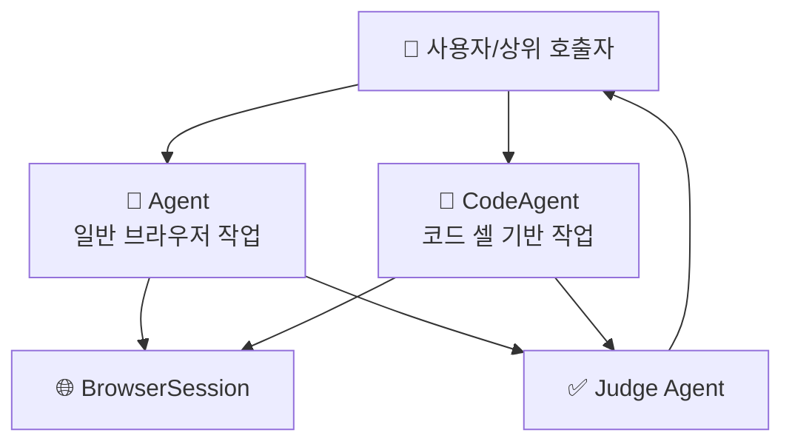

# 🤖 에이전트 구성

## 에이전트가 뭔가요?

browser-use에서 에이전트는 "브라우저 상태를 읽고 다음 행동을 결정하는 실행 주체"입니다.
핵심은 일반 목적 `Agent`와 코드 실행형 `CodeAgent`의 역할 분리입니다.

## 에이전트 관계도

아래 그림은 실제 역할 분담을 단순화한 구조입니다.

## 에이전트별 상세 설명

### Agent
- **역할**: 범용 브라우저 작업을 단계적으로 수행하는 메인 에이전트
- **파일 위치**: `browser_use/agent/service.py`
- **담당 업무**:
  - 스텝 루프 실행 및 상태 갱신
  - 프롬프트 구성과 LLM 호출
  - 액션 실행 및 히스토리 기록
  - 실패/재시도/타임아웃 처리
- **사용 모델**: `BaseChatModel` 계열 (OpenAI/Anthropic/Google 등)
- **출력 계약**: step 결과 + 누적 `AgentHistory`

### CodeAgent
- **역할**: LLM이 생성한 파이썬 코드를 실행해 브라우저를 제어하는 특화 에이전트
- **파일 위치**: `browser_use/code_use/service.py`
- **담당 업무**:
  - 코드 블록 생성/실행
  - notebook namespace 유지
  - `done()` 시그널 기반 종료
  - 결과 검증기(validator) 연동
- **사용 모델**: `ChatBrowserUse` 중심
- **출력 계약**: 코드 실행 결과 + notebook session 상태

### Judge Agent
- **역할**: 최종 결과 품질 검증 담당
- **파일 위치**: `browser_use/agent/judge.py`
- **담당 업무**:
  - 작업 목표 대비 완료도 판정
  - 최종 결과의 타당성 평가
- **사용 모델**: 설정된 LLM
- **출력 계약**: verdict JSON

## 에이전트 역할 분담표

| 에이전트 | 역할 한 줄 요약 | 입력 | 출력 | 책임 범위 |
|---------|----------------|------|------|----------|
| Agent | 일반 브라우저 자동화 루프 | task + browser_state + history | ActionResult/History | 범용 실행 |
| CodeAgent | 코드 셀 기반 자동화 | task + namespace + browser_state | 실행 로그/세션 결과 | 코드 중심 실행 |
| Judge Agent | 완료 품질 평가 | task + final_result + 증적 | verdict JSON | 검증/판정 |

## 참고: 비에이전트 지원 컴포넌트

`MCP Server`, `SessionServer`, `MessageManager`는 중요하지만 역할상 "에이전트"라기보다 인터페이스/인프라 컴포넌트입니다.
