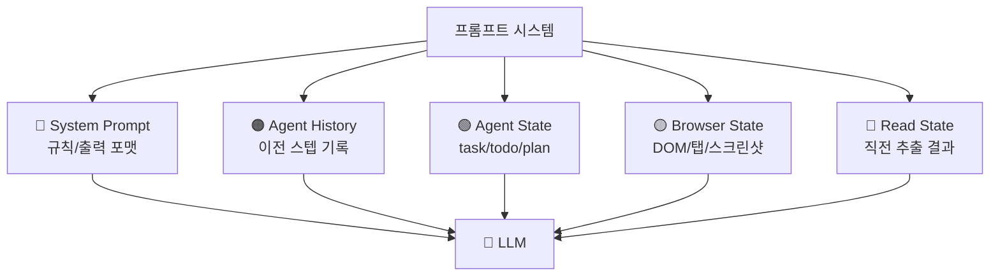
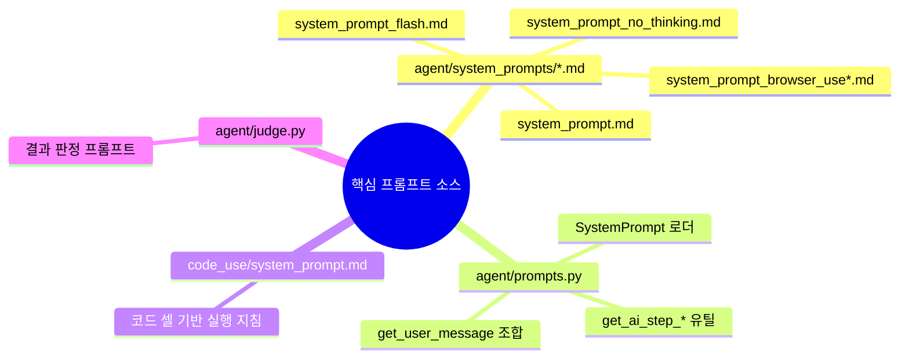

# 📝 프롬프트 분석

## 프롬프트가 뭔가요?

프롬프트는 "AI에게 주는 작업 지침"입니다.  
`browser-use`는 단순 문장 1개가 아니라, **히스토리 + 현재 브라우저 상태 + 규칙**을 합쳐 큰 컨텍스트를 만듭니다.

## 프롬프트 구조 개요

아래 그림은 `Agent` 모드의 프롬프트 조립 구조입니다.



## 발견된 프롬프트 목록

이 레포에서 프롬프트 관련 파일은 18개 탐지됐고, 실행 핵심은 아래입니다.



## 프롬프트별 상세 분석

### 1) 시스템 프롬프트 템플릿

- **위치**: `browser_use/agent/system_prompts/*.md` (총 8개)
- **용도**: Agent의 전역 규칙, 출력 JSON 스키마, 액션 규칙 강제
- **구조**: 규칙 섹션(`<browser_rules>`, `<task_completion_rules>`, `<reasoning_rules>` 등)
- **주요 인스트럭션**:
  - 항상 JSON 포맷으로 응답
  - `action`은 비어 있으면 안 됨
  - 완료 조건 전 `done` 남용 금지
  - 스크린샷 기반 검증 우선

### 2) 동적 User 메시지 빌더

- **위치**: `browser_use/agent/prompts.py`
- **용도**: 매 스텝마다 상태를 XML-like 태그로 조합
- **구조**: `<agent_history>`, `<agent_state>`, `<browser_state>`, `<read_state>` 블록

이 그림은 템플릿 결합 방식을 보여줍니다.

```mermaid
graph LR
    V1[agent_history_description] --> Final[UserMessage]
    V2[task/todo/plan/step_info] --> Final
    V3[browser_state + tabs + DOM] --> Final
    V4[screenshot(s)] --> Final
    V5[sensitive_data/available_file_paths] --> Final
    Final --> LLM
```

### 3) CodeAgent 시스템 프롬프트

- **위치**: `browser_use/code_use/system_prompt.md`
- **용도**: "한 번에 한 셀" 실행 방식, `done()` 호출 규칙, JS evaluate 패턴 안내
- **특징**:
  - Notebook mental model 강제
  - 코드 블록 규칙(다중 블록/네임드 블록) 명시
  - `8 consecutive errors` 자동 종료 규칙

### 4) Judge 프롬프트

- **위치**: `browser_use/agent/judge.py`
- **용도**: 최종 결과의 품질/완료 여부를 별도 LLM으로 판정
- **출력 스키마**: `reasoning`, `verdict`, `failure_reason`, `impossible_task`, `reached_captcha`

## 템플릿 변수/컨텍스트 키

| 변수/블록 | 타입 | 설명 | 예시 |
|--------|------|------|------|
| `{max_actions}` | int | 한 스텝 최대 액션 수 | 5 |
| `<agent_history>` | text | 이전 스텝 기록 | step_1...step_n |
| `<agent_state>` | text | task/todo/plan/step_info | 현재 목표 + 진행 상태 |
| `<browser_state>` | text | URL/탭/DOM 인덱스 | `[123]<button>...` |
| `<read_state>` | text | 직전 추출 결과(1회성) | extract/read_file 결과 |
| `<available_file_paths>` | text | 업로드/다운로드 가능한 경로 | `/tmp/file.pdf` |

## 관찰 포인트

- 모델 유형에 따라 프롬프트 파일을 분기 로딩함(`flash`, `anthropic`, `browser-use model`) 
- 긴 히스토리는 MessageManager compaction으로 요약해 토큰 사용량 제어
- 프롬프트 설계 자체가 "에이전트 루프 안정화"에 초점을 둔 구조
