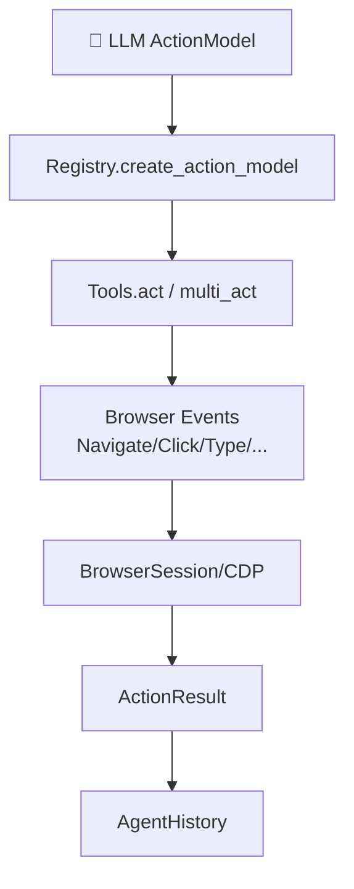
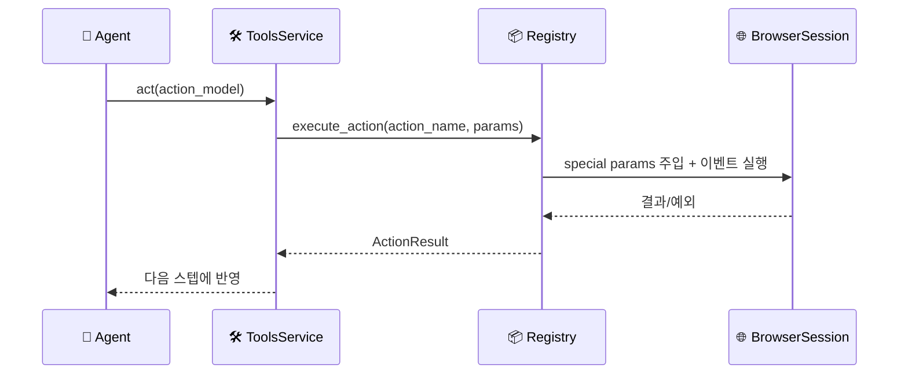

# 🛠️ 툴 & 함수

## 툴이 뭔가요?

툴은 AI가 실제 행동을 하기 위한 "실행 손"입니다.  
`browser-use`에서는 툴을 `Registry`에 등록하고, LLM이 선택한 액션을 `Tools.act()`가 실행합니다.

## 툴 전체 맵

아래 그림은 액션 실행 경로를 보여줍니다.

## 툴 호출 흐름

## 툴 목록 (핵심)

레포에서 확인된 액션은 기본 25개(+Gmail 1개)입니다.

| 툴 이름 | 카테고리 | 설명 | 입력 | 출력 | 파일 위치 |
|---------|---------|------|------|------|---------|
| `search` | 탐색 | 검색엔진 질의 | query, engine | 검색 이동 결과 | `tools/service.py` |
| `navigate` | 탐색 | URL 이동 | url, new_tab | 이동 결과 | `tools/service.py` |
| `click` | 상호작용 | 요소/좌표 클릭 | index 또는 좌표 | 클릭 결과 | `tools/service.py` |
| `input` | 상호작용 | 텍스트 입력 | index, text | 입력 결과 | `tools/service.py` |
| `scroll` | 상호작용 | 스크롤 | down/pages/index | 스크롤 결과 | `tools/service.py` |
| `switch` | 탭 | 탭 전환 | tab_id | 전환 결과 | `tools/service.py` |
| `close` | 탭 | 탭 닫기 | tab_id | 종료 결과 | `tools/service.py` |
| `extract` | 추출 | LLM 기반 내용 추출 | query, schema | 추출 텍스트/JSON | `tools/service.py` |
| `search_page` | 추출 | 페이지 내 텍스트 검색 | pattern 등 | 매치 목록 | `tools/service.py` |
| `find_elements` | 추출 | CSS 기반 요소 탐색 | selector | 요소 목록 | `tools/service.py` |
| `evaluate` | 실행 | JS 실행 | script | 반환값 | `tools/service.py` |
| `write_file` | 파일 | 파일 생성 | file_name, content | 저장 결과 | `tools/service.py` |
| `read_file` | 파일 | 파일 읽기 | file_name | 파일 내용 | `tools/service.py` |
| `replace_file` | 파일 | 파일 치환 | path, old/new | 변경 결과 | `tools/service.py` |
| `done` | 종료 | 작업 완료 반환 | text, success | 최종 응답 | `tools/service.py` |
| `get_recent_emails` | 통합 | 최근 메일 검색 | keyword, max_results | 메일 내용 | `integrations/gmail/actions.py` |

## 툴별 상세 특징

### Registry 기반 스키마 생성
- 함수 시그니처를 Pydantic 모델로 표준화
- `create_action_model()`로 LLM 응답 스키마 동적 구성
- 도메인 필터(`domains`)로 특정 URL에서만 액션 노출 가능

### 안정성 처리
- `terminates_sequence=True` 액션은 액션 체인 중단 규칙 적용
- 예외를 `ActionResult(error=...)`로 표준화해 루프가 깨지지 않도록 설계
- 민감정보 `<secret>...</secret>` 치환/검증 로직 내장

### 확장 포인트
- MCP 클라이언트(`mcp/client.py`)가 외부 MCP 툴을 액션으로 동적 등록
- CodeAgent 모드(`CodeAgentTools`)는 일부 액션을 기본 제외해 코드 중심 흐름 최적화
