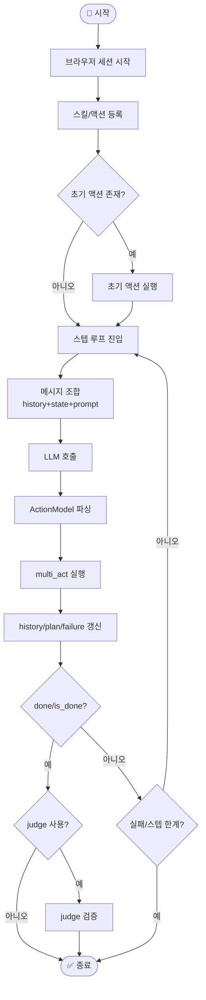
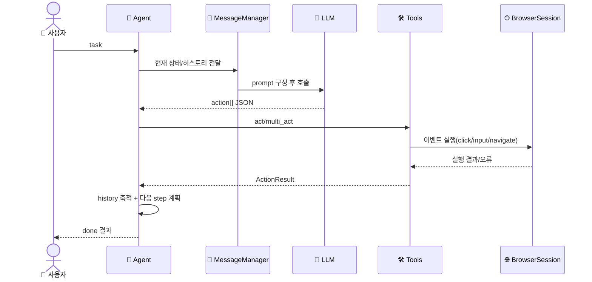
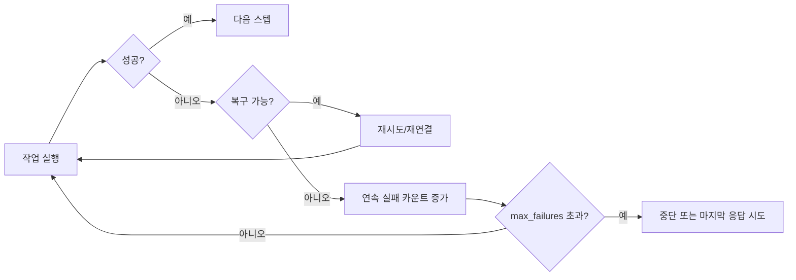

# 🔄 워크플로우

## 워크플로우가 뭔가요?

워크플로우는 "입력부터 결과까지의 처리 순서"입니다.  
`browser-use`는 `Agent` 모드와 `CodeAgent` 모드의 두 가지 주요 실행 흐름이 있습니다.

## 메인 워크플로우 (Agent)

이 다이어그램은 일반 `Agent.run()` 루프를 단순화한 것입니다.



## 에이전트 간 상호작용 흐름

이 그림은 Agent, LLM, Tools, BrowserSession 사이 메시지 흐름을 보여줍니다.



## CodeAgent 워크플로우

`CodeAgent`는 "코드 셀 실행"이라는 점에서 일반 Agent와 다릅니다.

```mermaid
flowchart LR
    A[Task] --> B[LLM이 Python 코드 생성]
    B --> C[코드 블록 추출/정리]
    C --> D[Namespace에서 실행]
    D --> E[브라우저 상태 갱신]
    E --> F{done() 호출됨?}
    F -->|아니오| B
    F -->|예| G[최종 결과 + 첨부파일 반환]
```

## 오류 처리 흐름



## 주요 시나리오별 흐름

1. **일반 웹 자동화**: `Agent -> Tools -> BrowserSession -> ActionResult`
2. **코드 기반 자동화**: `CodeAgent -> evaluate/navigate/click -> namespace 누적`
3. **MCP 연동**: `MCPClient가 외부 도구 스키마를 Action으로 변환 후 Agent가 동일 루프에서 사용`
4. **CLI 지속 세션**: `skill_cli/server.py`가 IPC로 세션을 유지해 명령 간 브라우저 상태 재사용
