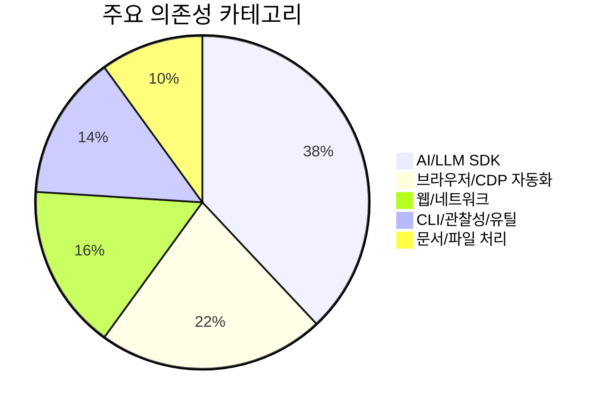

# 📦 기술 스택

## 기술 스택이 뭔가요?

기술 스택은 이 시스템을 만들기 위해 사용된 언어/라이브러리/외부 서비스 조합입니다.

## 기술 스택 구성

아래 그림은 `browser-use`의 레이어 구조를 보여줍니다.

```mermaid
graph TD
    subgraph "AI / LLM 레이어"
        A[🤖 LLM Providers
OpenAI/Anthropic/Google/Ollama/Groq/Mistral/Vercel]
        B[🧾 Prompting
system_prompts + prompts.py]
    end
    subgraph "애플리케이션 레이어"
        C[⚙️ Agent / CodeAgent]
        D[🛠️ Tools Registry + Actions]
        E[🔌 MCP / CLI SessionServer]
    end
    subgraph "브라우저 레이어"
        F[🌐 BrowserSession + CDP]
        G[👀 Watchdogs (14종)]
    end
    subgraph "운영/보조 레이어"
        H[📊 Telemetry/PostHog]
        I[📁 FileSystem]
    end

    A --> C
    B --> C
    C --> D --> F --> G
    C --> E
    C --> H
    D --> I
```

## 의존성 비중 (패키지 성격 기준)

아래 비율은 `pyproject.toml`의 핵심 의존성을 카테고리로 분류한 근사치입니다.



## 상세 스택

| 카테고리 | 기술/라이브러리 | 버전(예시) | 용도 |
|---------|--------------|------|------|
| 언어/런타임 | Python | >=3.11,<4.0 | 메인 런타임 |
| 브라우저 제어 | `cdp-use`, Playwright 설치 경로 | `cdp-use==1.4.5` | CDP 이벤트 기반 브라우저 제어 |
| 모델 SDK | `openai`, `anthropic`, `google-genai`, `ollama`, `groq` | 다수 | LLM 호출 추상화 |
| 스키마/검증 | `pydantic` | `2.12.5` | 액션/출력 모델 검증 |
| 네트워크 | `httpx`, `aiohttp`, `requests` | 고정 버전 | API 호출/클라우드 통신 |
| MCP | `mcp` | `1.26.0` | 외부 툴 프로토콜 연동 |
| CLI/TUI | `click`, `rich`, `InquirerPy`, `textual(optional)` | 고정 버전 | 사용자 인터페이스 |
| 관찰성 | `posthog`, telemetry 모듈 | - | 이벤트 수집 |
| 문서/파일 | `pypdf`, `python-docx`, `reportlab`, `markdownify` | - | 추출/파일 처리 |

## 추가 관찰

- 전통적 에이전트 프레임워크(LangChain/LangGraph) 의존 없이 자체 Agent+Action 레이어를 구현
- MCP를 통해 외부 툴 생태계와 결합하는 확장 전략 채택
- 단일 provider 종속이 아니라 "멀티 LLM 백엔드"를 기본 전제로 설계
