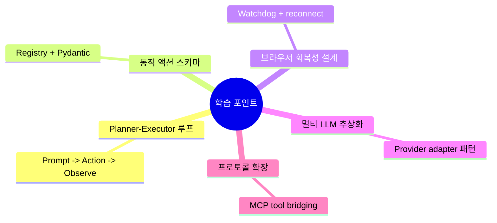

# 💡 핵심 인사이트 & 제안

## 잘 설계된 부분 👍

- `Agent -> ActionModel -> Registry -> BrowserEvent`로 이어지는 실행 체인이 일관적이라 확장성이 높습니다.
- `BrowserSession` + `SessionManager` + `Watchdog` 구조로 브라우저 불안정성(탭 detach, 캡차, 다운로드 등)을 운영 레벨에서 다룹니다.
- 프롬프트가 모델별로 분기(`flash`, `anthropic`, `browser_use_model`)되어 현실적인 품질/비용 튜닝이 가능합니다.
- `MessageCompaction`과 `ActionLoopDetector`가 장기 실행 시 토큰/루프 문제를 완화합니다.
- MCP 클라이언트/서버를 함께 제공해 "도구 확장"과 "도구 제공"을 모두 지원합니다.

## 주의해야 할 부분 ⚠️

- `browser_use/agent/service.py`와 `browser_use/tools/service.py`가 매우 큰 파일로 유지보수 난도가 높습니다.
- 핵심 액션이 단일 서비스 파일에 집중되어 있어 변경 영향 범위가 넓습니다.
- 프롬프트/규칙이 매우 방대해 모델별 지시 이탈 시 디버깅 비용이 커질 수 있습니다.
- MCP/CLI/Cloud까지 기능 범위가 넓어 테스트 전략이 모듈별로 더 정교해질 필요가 있습니다.
- 시크릿 관련: `.env.example`/환경변수 기반 설계는 적절하지만, 운영 시 도메인 제한(`allowed_domains`) 미설정은 위험할 수 있습니다.

## 초보자를 위한 학습 포인트 🎓

이 레포는 다음 에이전틱 패턴을 학습하기 좋습니다.

## 개선 제안 🚀

| 우선순위 | 제안 | 기대 효과 |
|---------|------|---------|
| 높음 | `agent/service.py`, `tools/service.py`를 도메인별 서브모듈로 분해 | 변경 영향 최소화, 테스트 용이성 향상 |
| 높음 | 액션 회귀 테스트를 시나리오 기반(탭/팝업/동적 DOM)으로 강화 | 실제 사이트 변동 대응력 향상 |
| 중간 | 프롬프트 템플릿 버전 관리(variant별 changelog) 도입 | 모델 교체/튜닝 시 추적성 확보 |
| 중간 | MCP 등록 액션의 권한/도메인 정책 표준화 | 외부 툴 연동 보안 강화 |
| 낮음 | 문서에서 Agent vs CodeAgent 선택 가이드 강화 | 초보자 온보딩 개선 |

## 한 줄 결론

`browser-use`는 "프롬프트-행동-브라우저-검증"의 전체 루프를 자체 구현한 실전형 에이전트 런타임이며, 특히 브라우저 안정성/확장성(MCP) 설계가 강점입니다.
