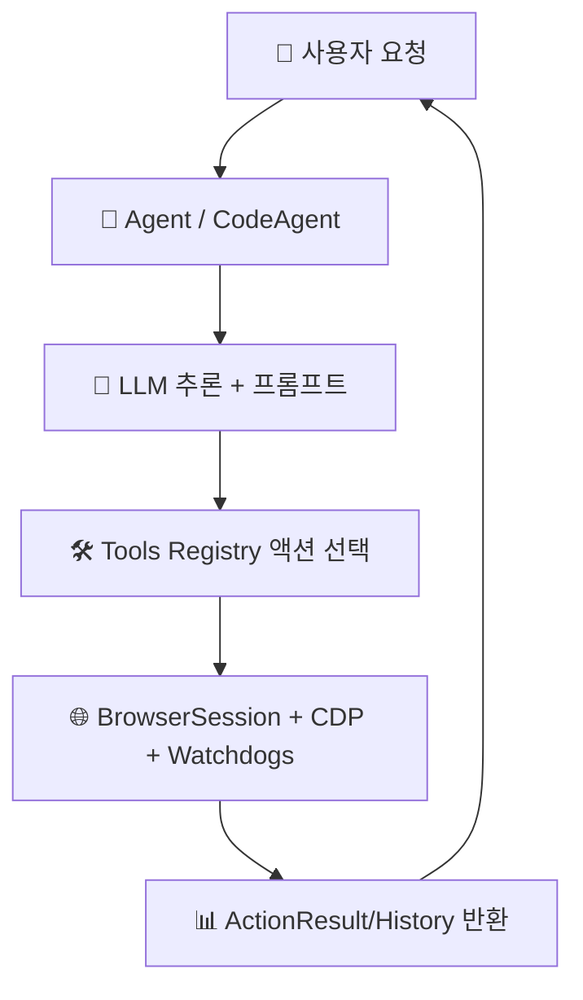

# 🔍 browser-use 분석 보고서

> **한 줄 요약**: 이 레포는 "AI가 웹 브라우저를 사람처럼 조작"하도록 만든 자동화 엔진입니다.  
> 분석일: 2026-03-03 | 레포: https://github.com/browser-use/browser-use | 커밋: `bf7775d`

## 📚 이 보고서 읽는 순서

처음 보는 분은 이 순서대로 읽으세요:

| 순서 | 파일 | 내용 | 소요 시간 |
|------|------|------|----------|
| 1 | [00_overview](./00_overview/summary.md) | 전체 그림 파악 | 5분 |
| 2 | [01_architecture](./01_architecture/architecture.md) | 시스템 구조 | 10분 |
| 3 | [02_agents](./02_agents/agents.md) | AI 에이전트 구성 | 10분 |
| 4 | [03_prompts](./03_prompts/prompts.md) | 프롬프트 설계 | 15분 |
| 5 | [04_tools](./04_tools/tools.md) | 툴/액션 체계 | 10분 |
| 6 | [05_workflows](./05_workflows/workflows.md) | 실행 워크플로우 | 15분 |
| 7 | [06_techstack](./06_techstack/techstack.md) | 기술 스택 | 5분 |
| 8 | [07_insights](./07_insights/insights.md) | 인사이트/개선안 | 10분 |

## 🗺️ 전체 구조 한눈에 보기

아래 그림은 `browser-use`의 핵심 실행 경로만 단순화해서 보여줍니다.

## 📊 주요 수치

| 항목 | 수치 |
|------|------|
| 총 파일 수 | 524개 |
| 핵심 에이전트 클래스 수 | 2개 (`Agent`, `CodeAgent`) |
| 프롬프트 관련 파일 수 | 18개 (핵심 시스템 프롬프트 템플릿 8개) |
| 정의된 툴/액션 수 | 26개 (기본 25 + Gmail 통합 1) |
| Watchdog 수 | 14개 |
| 사용 AI 프레임워크 | 자체 Agent+Tools 아키텍처, MCP 연동 |
| LLM 제공자 모듈 | 14개 이상 (OpenAI/Anthropic/Google/Ollama/Groq/Mistral 등) |

## ✅ 분석 범위

- 레포 구조/의존성/핵심 코드(에이전트, 프롬프트, 툴, 워크플로우, MCP) 중심으로 분석
- 바이너리/이미지 파일은 분석 대상에서 제외
- 시크릿 값은 기록하지 않고 "존재 여부"만 점검
