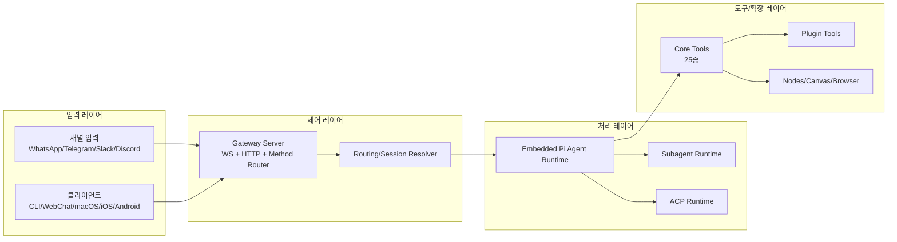
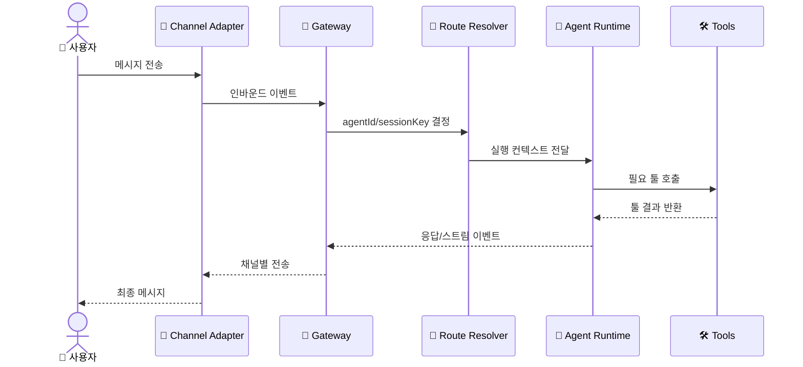

# 🏗️ 시스템 아키텍처

## 아키텍처란?

아키텍처는 "시스템의 부품과 연결 관계"를 보여주는 설계도입니다.
OpenClaw는 Gateway를 중심으로 Agent/Tool/Channel/Node가 붙는 허브 구조입니다.

## 전체 컴포넌트 구조

이 그림은 OpenClaw의 주요 레이어와 연결 방향을 보여줍니다.

## 데이터 흐름

아래 시퀀스는 일반적인 채널 메시지가 처리되는 시간 순서입니다.

## 계층별 설명

- 입력 레이어: 다양한 채널과 앱에서 이벤트 수신
- 제어 레이어: Gateway가 인증/검증/라우팅/세션 제어 담당
- 처리 레이어: 기본 에이전트 + 필요 시 Subagent/ACP로 분기
- 도구 레이어: 파일/실행/웹/메시지/노드/플러그인 툴 실행

