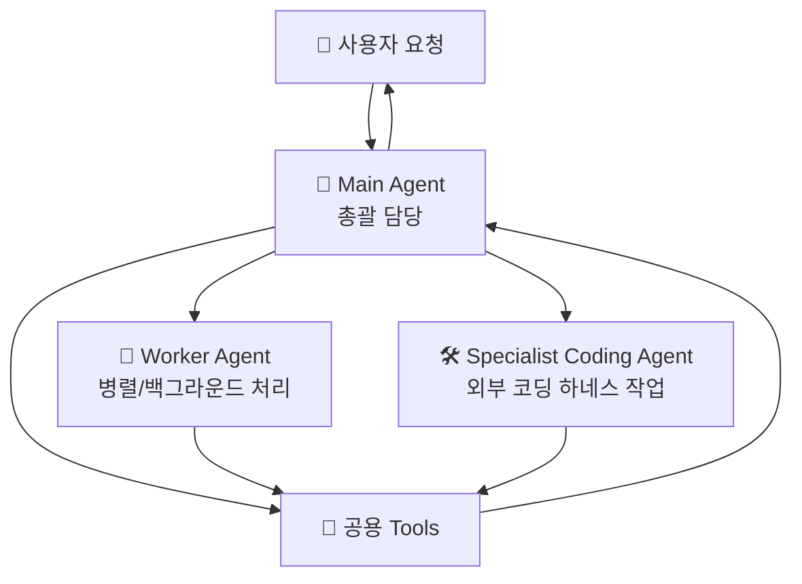

# 🤖 에이전트 구성

## 에이전트가 뭔가요?

OpenClaw에서 에이전트는 "요청을 이해하고, 필요한 도구를 선택하고, 결과를 만드는 담당자"입니다.
핵심은 1명의 메인 에이전트가 전체를 조율하고, 필요할 때 전문 에이전트에게 일을 위임하는 구조입니다.

## 에이전트 관계도

아래 그림은 OpenClaw를 **에이전트 관점**으로 단순화한 구조입니다.

## 에이전트별 상세 설명

### Main Agent (총괄 에이전트)
- **역할**: 사용자 요청의 기본 처리와 전체 흐름 조율
- **파일 위치**: `src/agents/pi-embedded-runner/run.ts`
- **담당 업무**:
  - 사용자 의도를 해석하고 실행 계획 수립
  - 직접 처리 가능한 작업은 즉시 실행
  - 필요 시 Worker/Specialist 에이전트에 위임
  - 여러 결과를 합쳐 최종 응답 생성
- **사용 모델**: 설정된 기본 모델(프로바이더/폴백 정책 적용)
- **사용 툴**: 코어 + 플러그인 툴 카탈로그

### Worker Agent (작업 분할 에이전트)
- **역할**: 오래 걸리거나 병렬 처리할 작업을 분담
- **파일 위치**: `src/agents/tools/sessions-spawn-tool.ts`, `src/agents/subagent-registry.ts`
- **담당 업무**:
  - 메인 에이전트가 넘긴 하위 태스크 수행
  - 독립적으로 중간 진행 후 결과 반환
  - 다중 하위작업 처리 시 충돌/깊이 제한 정책 준수
- **사용 모델**: 기본 모델 상속 또는 태스크별 override
- **사용 툴**: `sessions_spawn`, `sessions_send`, `subagents` 계열

### Specialist Coding Agent (코딩 전문 에이전트)
- **역할**: 외부 코딩 하네스(Codex/Claude/Gemini CLI) 연동이 필요한 작업 담당
- **파일 위치**: `src/agents/acp-spawn.ts`
- **담당 업무**:
  - 코드 작성/수정/검증형 작업을 전문 경로로 위임
  - 코딩 하네스 결과를 메인 에이전트가 재사용 가능하게 반환
  - 정책 조건(채널, 권한, 모드) 검증 후 실행
- **사용 모델**: ACP 백엔드가 제공하는 모델
- **사용 툴**: `sessions_spawn(runtime=acp)` 및 ACP 명령 경로

## 에이전트 역할 분담표

| 에이전트 | 역할 한 줄 요약 | 주 입력 | 주 출력 | 책임 범위 |
|---------|----------------|--------|--------|----------|
| Main Agent | 전체 조율 + 최종 응답 생성 | 사용자 요청, 대화 컨텍스트 | 최종 답변, 위임 지시 | 계획/분해/통합 |
| Worker Agent | 병렬/백그라운드 하위작업 처리 | 분할된 태스크 | 하위 결과, 상태 보고 | 실행 분담 |
| Specialist Coding Agent | 코딩 하네스 특화 작업 처리 | 코드 중심 태스크 | 코드 변경 결과, 실행 결과 | 전문 작업 |

## 한 줄 정리

OpenClaw의 에이전트 구조는 **Main(총괄) -> Worker(분담) / Specialist(전문)** 역할 분리로 이해하는 것이 가장 정확합니다.
