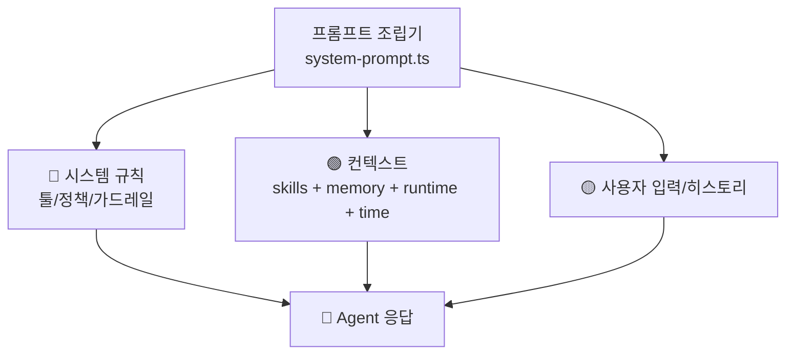
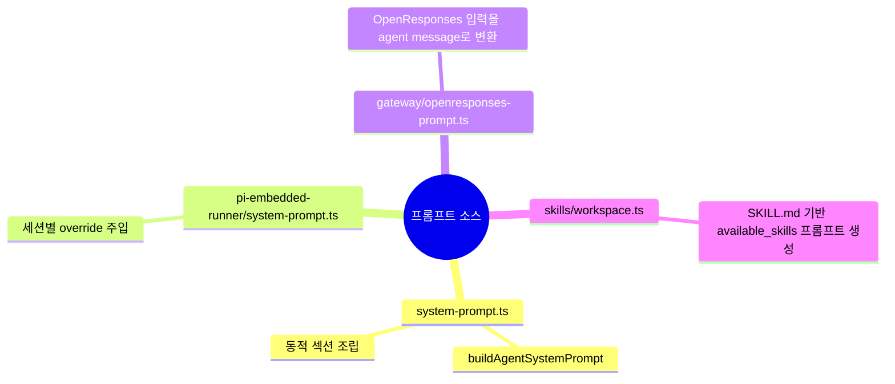
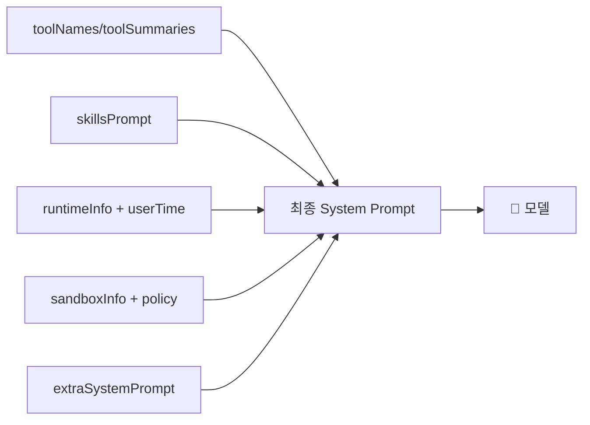

# 📝 프롬프트 분석

## 프롬프트가 뭔가요?

프롬프트는 에이전트에게 주는 "작업 규칙 + 실행 컨텍스트"입니다.
OpenClaw는 정적 템플릿 1개보다, 코드에서 상황에 맞는 섹션을 동적으로 조립하는 방식입니다.

## 프롬프트 구조 개요

아래 그림은 `buildAgentSystemPrompt` 중심의 프롬프트 조립 흐름입니다.

## 발견된 프롬프트 목록

주요 프롬프트 생성 지점은 아래 4가지입니다.

## 프롬프트별 상세 분석

### `buildAgentSystemPrompt` (`src/agents/system-prompt.ts`)

> **한 줄 설명**: OpenClaw의 핵심 시스템 프롬프트 조립기

이 함수는 tool list, skill prompt, runtime info, sandbox info, memory 정책 등을 합쳐 최종 system prompt를 생성합니다.

**템플릿 변수(주요 파라미터)**:

| 변수명 | 타입 | 설명 | 예시 |
|--------|------|------|------|
| `workspaceDir` | string | 작업 루트 경로 | `~/.openclaw/workspace` |
| `toolNames` | string[] | 현재 허용된 툴 이름 목록 | `read`, `exec`, `sessions_spawn` |
| `skillsPrompt` | string | 스킬 목록/설명 블록 | `<available_skills>...` |
| `runtimeInfo` | object | 실행 환경/모델/채널 정보 | `model=openai/gpt-5.2` |
| `sandboxInfo` | object | 샌드박스 모드/권한 정보 | `enabled=true` |

**주요 인스트럭션 요약**:

- 툴 사용 규칙과 메시징 동작 규칙 포함
- `memory_search/memory_get` 선탐색 가이드 포함 가능
- 스킬 적용 절차(1개 스킬 먼저 선택 후 읽기) 강제
- 샌드박스/채널/런타임 상황별 분기 지시 포함

### `buildEmbeddedSystemPrompt` (`src/agents/pi-embedded-runner/system-prompt.ts`)

> **한 줄 설명**: 실행 세션 컨텍스트를 `buildAgentSystemPrompt`에 맞춰 래핑

- `tools`, `runtimeInfo`, `skillsPrompt`, `memoryCitationsMode`를 결합해 호출
- `createSystemPromptOverride`로 세션 단위 프롬프트 덮어쓰기 가능

### `buildAgentPrompt` (`src/gateway/openresponses-prompt.ts`)

> **한 줄 설명**: OpenResponses 포맷(system/developer/message/function output)을 에이전트 입력으로 재구성

- system/developer는 `extraSystemPrompt`로 병합
- user/assistant/tool 흐름은 `buildAgentMessageFromConversationEntries`로 정규화

### Skills Prompt (`src/agents/skills/workspace.ts`)

> **한 줄 설명**: `SKILL.md`들을 스냅샷으로 읽어 모델에 주입할 스킬 프롬프트 생성

- 로딩 우선순위: workspace > managed > bundled
- 과대 스킬/대용량 파일 제한으로 토큰 폭주 방지
- 설정/환경/바이너리 존재 여부로 스킬 필터링
