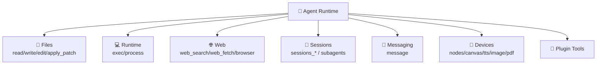
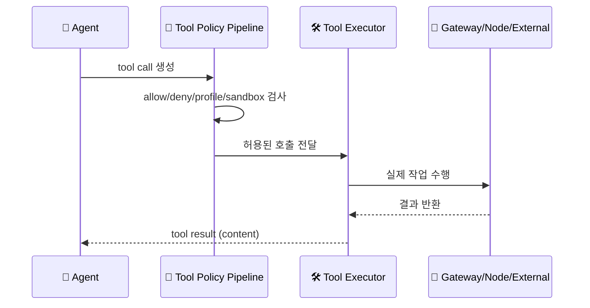

# 🛠️ 툴 & 함수

## 툴이 뭔가요?

툴은 에이전트가 실제 행동을 하기 위해 호출하는 기능 단위입니다.
OpenClaw는 파일/실행/웹/메시지/세션/노드/플러그인 영역을 한 툴 체계로 묶습니다.

## 툴 전체 맵

아래 그림은 코어 툴 그룹이 어떤 도메인을 덮는지 보여줍니다.

## 툴 호출 흐름

OpenClaw에서 툴 호출은 정책 파이프라인을 거쳐 실행됩니다.

## 코어 툴 목록 (25개)

`src/agents/tool-catalog.ts` 기준 코어 툴 정의는 25개입니다.

- Files: `read`, `write`, `edit`, `apply_patch`
- Runtime: `exec`, `process`
- Web: `web_search`, `web_fetch`, `browser`
- Memory: `memory_search`, `memory_get`
- Sessions: `sessions_list`, `sessions_history`, `sessions_send`, `sessions_spawn`, `subagents`, `session_status`
- Messaging/Automation/Nodes: `message`, `cron`, `gateway`, `nodes`, `agents_list`
- Media: `image`, `tts`, `canvas`

## 툴별 상세 설명 (핵심)

### `sessions_spawn`
- **한 줄 설명**: 분리 세션을 새로 만들어 작업을 위임
- **언제 사용**: 병렬 작업/장기 작업/ACP 하네스 실행
- **파라미터**: `task`, `runtime(subagent|acp)`, `agentId`, `mode`, `thread`, `sandbox` 등
- **반환값**: `status`, `runId`, `childSessionKey`

### `subagents`
- **한 줄 설명**: 실행 중인 하위 에이전트 조회/종료/steer
- **언제 사용**: orchestrator가 자식 실행 흐름 관리할 때
- **파라미터**: `action(list|kill|steer)`, `target`, `message`
- **반환값**: 상태 목록/조작 결과

### `message`
- **한 줄 설명**: 채널 전송/반응/버튼/카드 등 메시징 액션 실행
- **언제 사용**: proactive send 또는 채널별 action 필요 시
- **파라미터**: `action`, `channel`, `target`, `message`, `buttons`, `card`, `components`
- **반환값**: 채널별 실행 결과

### `createOpenClawTools` / `createOpenClawCodingTools`
- **한 줄 설명**: 세션/채널/정책 조건에 맞춰 실제 툴 세트를 조립
- **언제 사용**: 에이전트 런 시작 시
- **반환값**: 현재 런에서 노출할 툴 배열(코어 + 플러그인)
