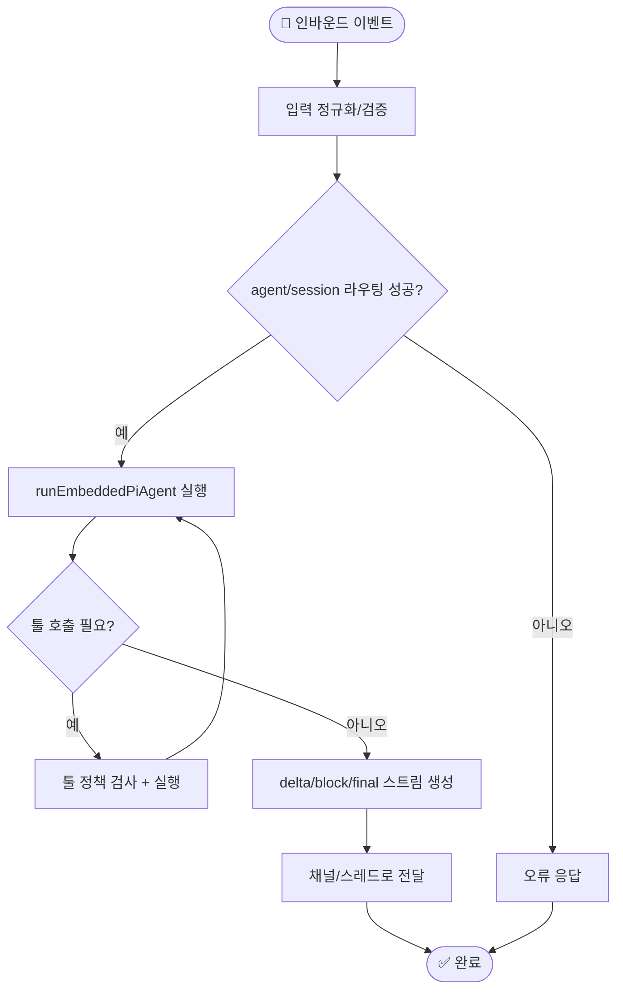
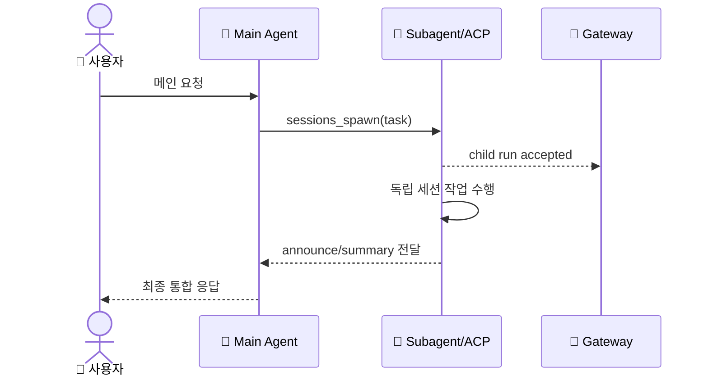
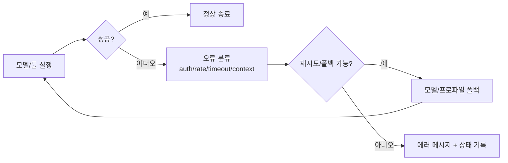

# 🔄 워크플로우

## 워크플로우가 뭔가요?

워크플로우는 "메시지가 들어와서 어떤 단계로 처리되는지"를 보여주는 순서도입니다.
OpenClaw는 채널 입력을 Gateway가 받아 세션 라우팅 후 Agent 런타임을 돌리고, 결과를 같은 채널로 되돌려 보냅니다.

## 메인 워크플로우

아래는 `dispatchInboundMessage` + Gateway chat/agent 경로를 합친 핵심 흐름입니다.

## 에이전트 간 상호작용 흐름

`sessions_spawn` 사용 시 메인-서브 구조는 아래처럼 동작합니다.

## 오류 처리 흐름

실패 시에는 failover와 재시도/정책 분기로 복구를 시도합니다.

## 주요 시나리오별 흐름

- 기본 채널 응답: `gateway.server-methods.chat -> dispatchInboundMessage -> runEmbeddedPiAgent`
- 세션 간 위임: `sessions_send` 또는 `sessions_spawn` 후 announce
- ACP 위임: `sessions_spawn(runtime=acp)`에서 정책 검증 후 ACP 세션 생성
- 큐 모드: `collect`, `steer`, `followup`, `interrupt` 정책으로 인바운드 충돌 처리
