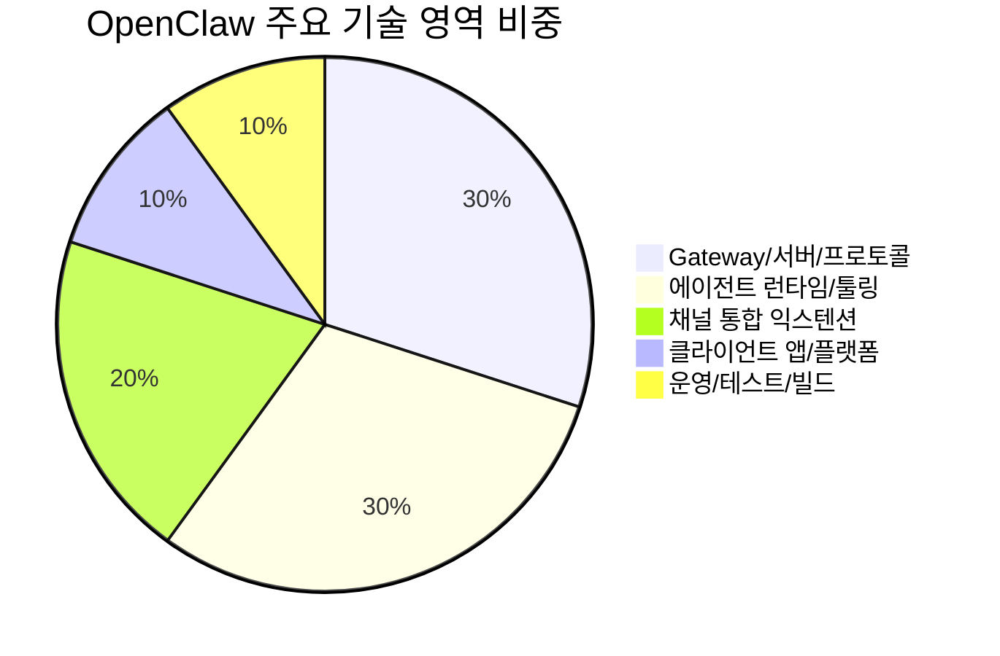

# 📦 기술 스택

## 기술 스택이 뭔가요?

기술 스택은 시스템을 구현/실행/배포하는 도구 묶음입니다.
OpenClaw는 TypeScript 모노레포를 중심으로 Gateway + Agent + 앱/확장을 함께 운영합니다.

## 기술 스택 구성

아래 그림은 주요 레이어와 대표 기술을 보여줍니다.

```mermaid
graph TD
    subgraph "AI / Agent 레이어"
        A[🤖 pi-agent-core]
        B[🧠 pi-coding-agent]
        C[🔗 ACP SDK]
    end
    subgraph "애플리케이션 레이어"
        D[⚙️ OpenClaw Gateway (TS/Node)]
        E[🔌 Tool/Plugin Runtime]
        F[💬 Channel Extensions]
    end
    subgraph "인프라/앱 레이어"
        G[🌐 WebSocket + HTTP]
        H[📱 macOS/iOS/Android Apps]
        I[🐳 Docker Sandbox]
    end

    A --> D
    B --> D
    C --> D
    D --> E
    D --> F
    D --> G
    G --> H
    E --> I
```

## 의존성 비중 (레포 목적 기반)

의존성 수치와 모듈 성격을 함께 고려해 분류하면 아래 비중으로 볼 수 있습니다.



## 상세 스택

| 카테고리 | 기술/라이브러리 | 버전/규모 | 용도 |
|---------|--------------|------|------|
| 언어/런타임 | Node.js + TypeScript | Node `>=22.12.0` | 핵심 서버/에이전트 구현 |
| 패키지 관리 | pnpm workspace | workspace 4영역 (`.`, `ui`, `packages/*`, `extensions/*`) | 모노레포 의존성 관리 |
| 에이전트 코어 | `@mariozechner/pi-agent-core`, `pi-coding-agent` | `0.55.3` | LLM 실행 루프/툴 프레임워크 |
| 프로토콜 | `@agentclientprotocol/sdk` | `0.14.1` | ACP 런타임 연동 |
| 서버 | Express, ws, TypeBox, Ajv | package.json deps | Gateway WS/HTTP + 스키마 검증 |
| 브라우저/미디어 | playwright-core, sharp, pdfjs-dist | package.json deps | 브라우저 자동화/이미지/PDF 처리 |
| 채널 SDK | grammY, Slack Bolt, discord.js 등 | package.json deps | 멀티채널 메시징 통합 |
| 테스트/품질 | Vitest, oxlint, oxfmt, SwiftLint | CI 파이프라인 포함 | 단위/통합/라이브/도커 테스트 |
| 확장 생태계 | extensions 33개, skills 52개 | repo 내 패키지 | 채널/기능 확장 및 지식 주입 |

## 운영 포인트

- CI는 docs-only/changed-scope 감지로 무거운 잡을 조건부 실행
- Python 검사 경로(`pyproject.toml`)는 스킬 테스트 품질 검증에 사용
