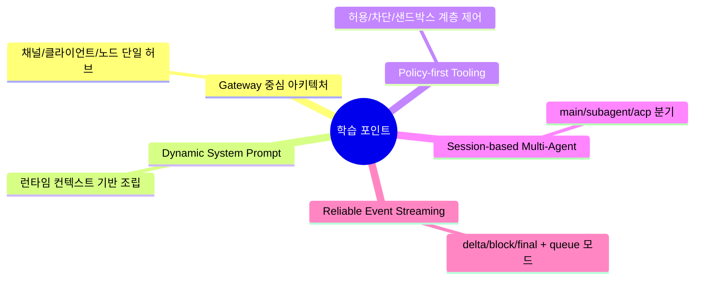

# 💡 핵심 인사이트 & 제안

## 잘 설계된 부분 👍

- Gateway 중심 제어평면이 명확함: `src/gateway/server.impl.ts`가 채널/노드/툴/세션 오케스트레이션을 일관되게 묶음
- 툴 정책 계층화가 탄탄함: `pi-tools.policy.ts`, `tool-policy-pipeline.ts`로 allow/deny/profile/sandbox 규칙이 분리됨
- 서브에이전트 라이프사이클 관리가 상세함: `subagent-registry.ts`에 announce 재시도, orphan 정리, cascade kill 등 운영 로직이 잘 들어감
- 스킬 시스템의 실전성이 높음: `skills/workspace.ts`에서 로드 우선순위/크기 제한/환경 기반 필터링까지 처리
- 문서와 코드 연결성이 좋음: `docs/concepts/*`, `docs/tools/*`가 실제 구현 모듈과 1:1로 대응되는 편

## 주의해야 할 부분 ⚠️

- 레포 규모/복잡도 리스크: 7천+ 파일, `src/agents`만 700+ TS 파일이라 온보딩 난이도가 높음
- 경로 다변화로 인한 인지 부담: Gateway/agents/commands/plugins/extensions에서 유사 책임이 분산되어 변경 영향 추적이 어려움
- 프롬프트 표면 확장: `*prompt*` 관련 파일이 많아(96개) 정책 일관성 드리프트 가능성 존재
- ACP/Subagent/Main 경로 공존: 실행 분기가 많아 회귀 테스트 범위 관리가 필수

## 초보자를 위한 학습 포인트 🎓

이 레포에서 배울 수 있는 에이전틱 패턴은 아래와 같습니다.

## 개선 제안 🚀

| 우선순위 | 제안 | 기대 효과 |
|---------|------|---------|
| 높음 | `src/agents` 내부를 런타임/정책/툴/세션 하위 패키지로 공식 모듈 경계화 | 대규모 변경 시 영향도 축소 |
| 높음 | 프롬프트 조립 경로(`system-prompt*`, `openresponses-prompt`)에 계약 테스트/스냅샷 테스트 강화 | 프롬프트 드리프트 방지 |
| 중간 | `runtime=subagent` vs `runtime=acp` 결정 가이드(자동 라우팅 규칙) 문서/코드 연결 강화 | 운영자/모델 오사용 감소 |
| 중간 | Core Tool 25개에 대해 권한 민감도 태깅(읽기/쓰기/외부통신/고위험) 표준화 | 보안 점검 자동화 용이 |
| 낮음 | 신규 기여자용 "핵심 경로 30분 투어" 문서 추가 | 온보딩 시간 단축 |
