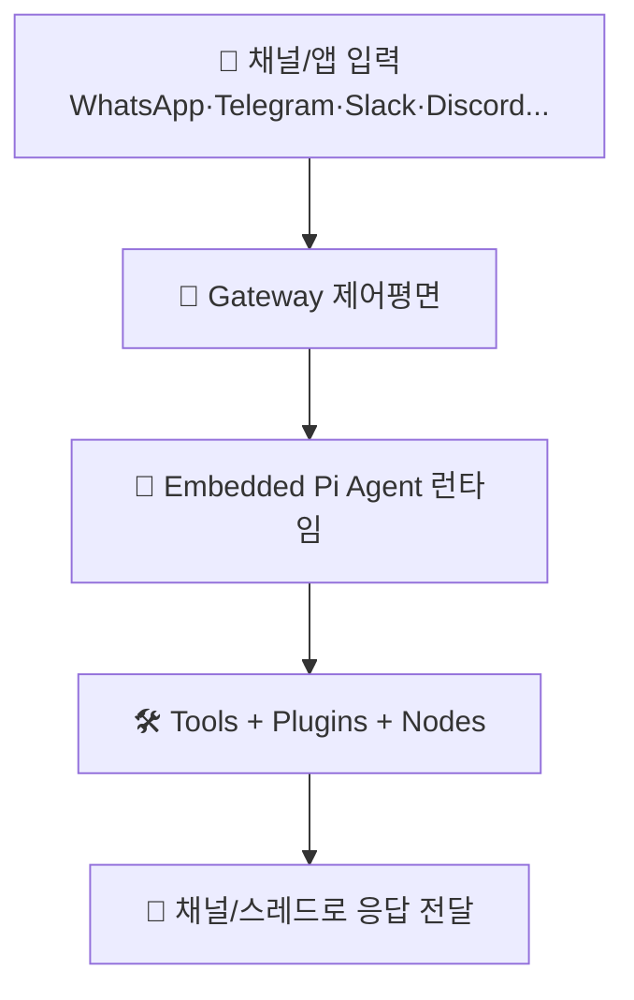

# 🔍 openclaw 분석 보고서

> **한 줄 요약**: OpenClaw는 여러 채팅앱/디바이스를 하나의 Gateway로 묶고, 단일 기본 에이전트가 필요할 때 서브에이전트/ACP 런타임으로 확장해 일하는 개인 AI 운영체제입니다.
> 분석일: 2026-03-03 | 레포: https://github.com/openclaw/openclaw | 커밋: `de9031d`

## 📚 이 보고서 읽는 순서

처음 보는 분은 이 순서대로 읽으세요:

| 순서 | 파일 | 내용 | 소요 시간 |
|------|------|------|----------|
| 1 | [00_overview](./00_overview/summary.md) | 전체 그림 파악 | 5분 |
| 2 | [01_architecture](./01_architecture/architecture.md) | 시스템 구조 | 10분 |
| 3 | [02_agents](./02_agents/agents.md) | AI 에이전트들 | 10분 |
| 4 | [03_prompts](./03_prompts/prompts.md) | 프롬프트 설계 | 15분 |
| 5 | [04_tools](./04_tools/tools.md) | 사용 가능한 도구들 | 10분 |
| 6 | [05_workflows](./05_workflows/workflows.md) | 실제 동작 흐름 | 15분 |
| 7 | [06_techstack](./06_techstack/techstack.md) | 기술 스택 | 5분 |
| 8 | [07_insights](./07_insights/insights.md) | 인사이트 & 제안 | 10분 |

## 🗺️ 전체 구조 한눈에 보기

아래 그림은 OpenClaw의 핵심 실행 루프(채널 입력 -> Gateway -> Agent -> Tool/채널 출력)를 단순화한 것입니다.

## 📊 주요 수치

| 항목 | 수치 |
|------|------|
| 총 파일 수 | 7,277개 (`.git`/`node_modules` 제외) |
| 에이전트 수 | 3개 핵심 런타임 (Main Agent, Subagent, ACP Session) |
| 프롬프트 관련 파일 수 | 96개 (`*prompt*`, `*system*`, 템플릿/가이드 포함) |
| 정의된 코어 툴 수 | 25개 (`src/agents/tool-catalog.ts`) |
| 사용 AI 프레임워크 | `@mariozechner/pi-agent-core`, `@mariozechner/pi-coding-agent`, `@agentclientprotocol/sdk` |

## ✅ 분석 범위

- 핵심 런타임: `src/agents/*`, `src/auto-reply/*`, `src/routing/*`
- Gateway 제어평면: `src/gateway/*`, `src/cli/gateway-cli/*`
- 툴/플러그인: `src/agents/tools/*`, `src/plugins/*`, `extensions/*`
- 문서 근거: `docs/concepts/*`, `docs/tools/*`, `docs/channels/*`
- 시크릿: `.env.example` 기준으로 키 이름만 문서화되어 있으며 실제 비밀값은 포함되지 않음
