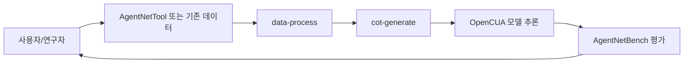

# 📖 이 시스템은 무엇인가요?

## 쉬운 설명

OpenCUA는 "컴퓨터 사용 AI 학교"에 가깝습니다.
- `AgentNet`: 교재(사람이 실제로 컴퓨터를 조작한 데이터)
- `OpenCUA 모델`: 학생(화면을 보고 다음 행동을 예측)
- `AgentNetBench`: 시험지(예측 행동이 정답 행동과 얼마나 맞는지 채점)

## 이 시스템이 하는 일

사용자 관점에서 보면 다음과 같습니다.
1. 데모 데이터(영상/이벤트)를 넣는다.
2. 표준화 + CoT 보강을 거쳐 학습/평가 가능한 데이터로 만든다.
3. 모델이 다음 GUI 액션을 예측한다.
4. 평가기가 step 단위 점수와 평균 점수를 계산한다.

## 전체 구조 다이어그램

아래 그림은 OpenCUA의 큰 흐름을 보여줍니다.



## 디렉토리 구조

각 폴더의 핵심 역할은 다음과 같습니다.

```text
OpenCUA/
├── README.md                      ← 전체 프로젝트 소개
├── model/
│   ├── README.md                  ← OpenCUA 모델 사용법
│   └── inference/                 ← HF/vLLM 추론 예제
├── evaluation/
│   └── agentnetbench/             ← 오프라인 벤치마크 평가기
├── data/
│   ├── data-process/              ← raw -> standardized 변환
│   ├── cot-generate/              ← 반성형 CoT 생성
│   └── vis/                       ← Streamlit 시각화
├── assets/images/                 ← 문서용 이미지
└── tool/ (git submodule)          ← AgentNetTool 연결 지점
```

## 핵심 용어 설명

| 용어 | 쉬운 설명 |
|------|----------|
| 에이전트 (Agent) | 화면+지시를 보고 다음 GUI 행동을 제안하는 실행 단위 |
| 프롬프트 (Prompt) | 모델에게 어떤 형식으로 사고/출력을 하라고 지시하는 텍스트 템플릿 |
| 툴 (Tool) | `click`, `type`, `scroll` 같은 실행 가능한 액션 인터페이스 |
| 워크플로우 (Workflow) | 데이터 처리, 추론, 평가가 이어지는 순서 |
| Trajectory | 한 태스크를 완료하기 위한 step들의 시계열 묶음 |
| Inner Monologue | 각 step에서 모델이 생성한 관찰/생각/행동 설명 |
