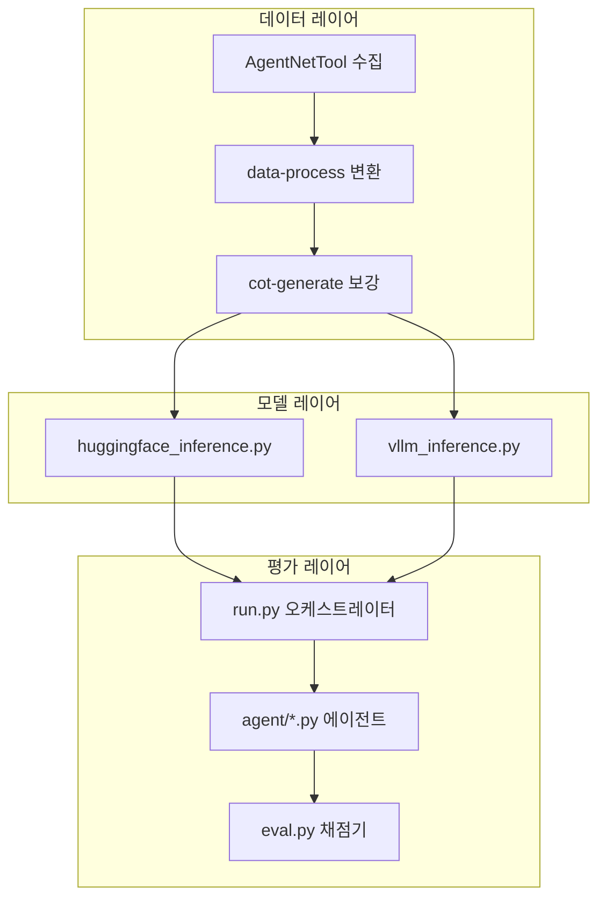
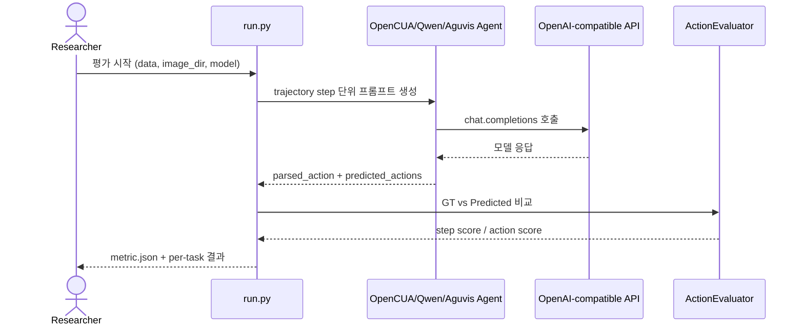

# 🏗️ 시스템 아키텍처

## 아키텍처란?

아키텍처는 "어떤 부품이 어떤 역할로 연결되는지"를 보여주는 설계도입니다.
OpenCUA는 단일 앱 서버형보다, 데이터/모델/평가 모듈이 분리된 연구 파이프라인 구조입니다.

## 전체 컴포넌트 구조

아래 그림은 OpenCUA의 모듈 경계를 보여줍니다.

## 데이터 흐름

아래는 평가 실행 시의 시간 순서 흐름입니다.

## 계층별 설명

- 데이터 레이어: 원시 이벤트를 학습 가능한 trajectory로 변환하고 CoT를 합성합니다.
- 모델 레이어: OpenCUA 가중치를 HF 또는 vLLM 경로로 추론합니다.
- 평가 레이어: 에이전트별 파싱 규칙을 적용해 예측 행동을 구조화하고 점수화합니다.
