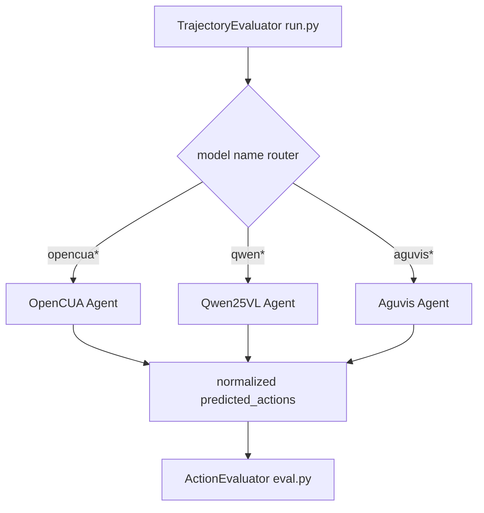

# 🤖 에이전트 구성

## 에이전트가 뭔가요?

이 레포에서 에이전트는 "특정 모델 출력 형식을 해석해서 행동 리스트로 바꾸는 어댑터"입니다.
즉, 온라인 실행용 거대 멀티에이전트 구조보다 **평가 벤치마크에서 모델별 역할을 분리한 에이전트 구조**에 가깝습니다.

## 에이전트 선택 규칙

`run.py`는 모델명 문자열로 에이전트를 단일 선택합니다.

- `--model`에 `opencua` 포함: **OpenCUA Agent**
- `--model`에 `qwen2.5-vl`, `qwen-vl`, `qwen25vl` 포함: **Qwen25VL Agent**
- `--model`에 `aguvis` 포함: **Aguvis Agent**

즉 한 번의 평가 실행에서 3개가 협업하는 구조가 아니라, **1개를 선택해 전체 step을 처리**하는 구조입니다.

## 에이전트 관계도(책임 경계)

아래 그림은 `run.py`와 에이전트 클래스의 관계입니다.

## 에이전트별 상세 설명

### OpenCUA
- **역할**: OpenCUA 계열 출력을 파싱하고 좌표 정규화까지 수행
- **파일 위치**: `evaluation/agentnetbench/agent/opencua.py`
- **담당 업무**:
  - L1/L2/L3(+short) 프롬프트 모드 선택
  - history(action/thought/observation) 구성
  - `pyautogui.*`, `computer.*` 라인 추출
  - 픽셀 좌표를 상대좌표로 정규화
- **사용 모델**: OpenAI-compatible endpoint에 호스팅된 OpenCUA 계열
- **사용하는 툴/액션**: click/move/drag/type/press/hotkey/scroll/terminate/triple_click
- **하지 않는 일**: 채점 로직(점수 계산)은 담당하지 않음 (`eval.py`가 담당)

### Qwen25VL
- **역할**: Qwen 함수호출(`<tool_call>`) JSON을 pyautogui 명령으로 변환
- **파일 위치**: `evaluation/agentnetbench/agent/qwen25vl.py`
- **담당 업무**:
  - 멀티이미지 히스토리 프롬프트 구성
  - `computer_use` 함수 JSON 파싱
  - smart-resize 기준 좌표 역정규화
  - 액션 추출/정규화
- **사용 모델**: Qwen2.5-VL 계열 또는 호환 모델
- **사용하는 툴/액션**: computer_use 함수의 11개 action enum 기반
- **하지 않는 일**: OpenCUA L1/L2/L3 템플릿 기반 장문 프롬프트 모드는 담당하지 않음

### Aguvis
- **역할**: Aguvis 출력 문자열에서 pyautogui 액션만 추출
- **파일 위치**: `evaluation/agentnetbench/agent/aguvis.py`
- **담당 업무**:
  - 단순 system/user prompt 구성
  - action line 추출
  - click/write/press/scroll 등 기본 액션 파싱
- **사용 모델**: Aguvis 계열
- **사용하는 툴/액션**: pyautogui 명령 기반 기본 액션
- **하지 않는 일**: 함수호출 JSON(`<tool_call>`) 파싱이나 복잡한 히스토리 이미지 전략은 담당하지 않음

## 에이전트 역할 분담표(명확 버전)

| 구분 | OpenCUA | Qwen25VL | Aguvis |
|------|---------|----------|--------|
| 선택 조건 | model명에 `opencua` | model명에 `qwen*` | model명에 `aguvis` |
| 주 입력 포맷 | 자유 텍스트 + OpenCUA 템플릿 | `<tool_call>` JSON 중심 | 자유 텍스트 중심 |
| 핵심 책임 | L1/L2/L3 프롬프트 + 좌표 정규화 | 함수호출 파싱 + 멀티이미지 히스토리 | 단순 문자열 파싱 |
| 좌표 처리 | 픽셀->상대좌표 변환 적극 수행 | smart-resize 기준 보정 수행 | 최소 처리 |
| 강점 | OpenCUA 규약 충실도 | 구조화 출력 파싱 안정성 | 경량/단순성 |
| 공통 출력 계약 | `parsed_action`, `actions`를 `run.py`로 반환 | `parsed_action`, `actions`를 `run.py`로 반환 | `parsed_action`, `actions`를 `run.py`로 반환 |
