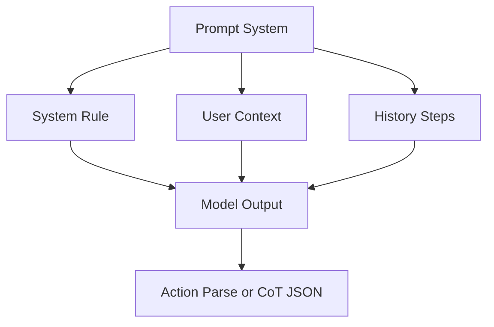
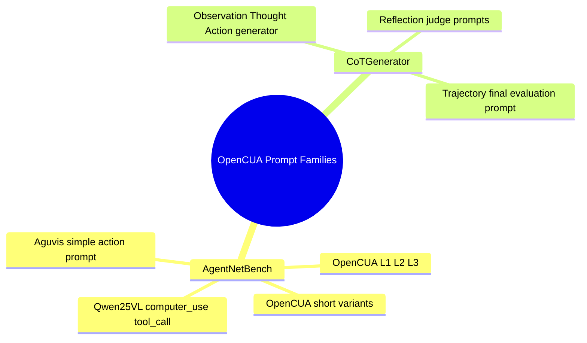
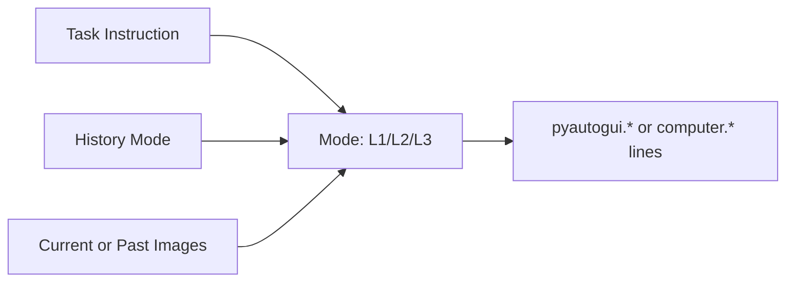

# 📝 프롬프트 분석

## 프롬프트가 뭔가요?

프롬프트는 모델에게 "어떤 정보로 어떤 형식의 답을 만들지"를 지시하는 규칙입니다.
OpenCUA는 평가용 프롬프트와 CoT 데이터생성용 프롬프트를 분리해 운용합니다.

## 프롬프트 구조 개요

아래 그림은 공통 구조를 단순화한 것입니다.

## 발견된 프롬프트 맵

프롬프트 군집은 아래처럼 나뉩니다.

## 프롬프트별 상세 분석

### 1) AgentNetBench OpenCUA 프롬프트 (`evaluation/agentnetbench/agent/opencua.py`)

> **한 줄 설명**: 평가 시 모델에게 step 형식(Observation/Thought/Action/Code)을 강제하는 템플릿.

**구조 분석**:

- 모드: `l1`, `l2`, `l3`, `l1_short`, `l2_short`, `l3_short`
- 히스토리: `action` / `thought` / `observation`
- 이미지 컨텍스트: `image_1` / `image_3` / `image_5`

### 2) Qwen tool-call 프롬프트 (`evaluation/agentnetbench/agent/qwen25vl.py`)

- 함수 스키마: `computer_use(action, keys, text, coordinate, pixels, time, status)`
- 출력 규약: `<tool_call>{"name":"computer_use","arguments":...}</tool_call>`
- 장점: 구조화 JSON이라 파싱 안정성이 높음

### 3) CoT 생성 프롬프트 (`data/cot-generate/module/*.py`)

**템플릿 변수 예시**:

| 변수명 | 타입 | 설명 | 예시 |
|--------|------|------|------|
| `{goal}` | string | 태스크 목표 | "브라우저에서 날씨 검색" |
| `{previous_actions}` | string | step 히스토리 | `Step 1: ...` |
| `{former_thought}` | string | 직전 사고 | "검색창이 활성화됨" |
| `{former_action_effect}` | string | 직전 행동 효과 | "팝업이 닫힘" |
| `{action_commands}` | string | 예측 코드 | `pyautogui.click(...)` |

- 생성 템플릿: mouse/keyboard + reflect 버전
- 반성 템플릿: `last_step_correct`, `last_step_redundant`, `reflection` JSON 강제
- 궤적 평가 템플릿: `alignment_score`, `efficiency_score`, `task_difficulty` 생성
