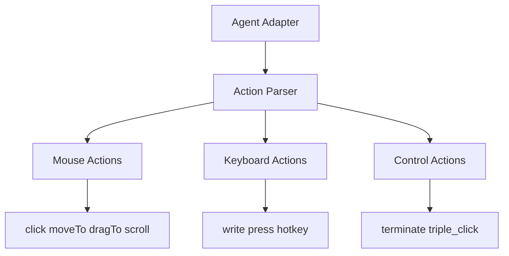
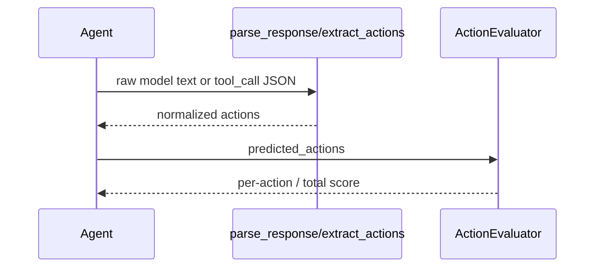

# 🛠️ 툴 & 함수

## 툴이 뭔가요?

OpenCUA에서 툴은 외부 검색 API보다 "GUI 액션 인터페이스"에 가깝습니다.
즉 모델 출력을 실행 가능한 액션 단위(click/type/scroll 등)로 표현합니다.

## 툴 전체 맵

아래 그림은 에이전트가 액션 인터페이스를 어떻게 사용하는지 보여줍니다.

## 툴 호출 흐름

## 툴 목록

| 툴 이름 | 카테고리 | 설명 | 입력 | 출력 | 파일 위치 |
|---------|---------|------|------|------|---------|
| `click`, `doubleClick`, `rightClick`, `middleClick` | Mouse | 좌표 기반 클릭 | x,y | 클릭 액션 | `agent/*.py` |
| `moveTo`, `dragTo`, `scroll` | Mouse | 이동/드래그/스크롤 | x,y 또는 pixels | 이동 액션 | `agent/*.py` |
| `write`, `press`, `hotkey` | Keyboard | 텍스트 입력/키 조합 | text, keys | 키보드 액션 | `agent/*.py` |
| `computer.terminate` | Control | 성공/실패 종료 선언 | status | 종료 액션 | `agent/opencua.py`, `agent/qwen25vl.py` |
| `computer.triple_click` | Control | 특수 3회 클릭 | x,y | triple_click | `agent/opencua.py`, `agent/qwen25vl.py` |

## 툴별 상세 포인트

- `qwen25vl.py`: `<tool_call>` JSON을 pyautogui 명령으로 복원
- `opencua.py`: 픽셀 좌표(리사이즈 기준) -> 상대좌표 변환
- `eval.py`: `write+enter` 병합, bbox 허용 판정 등 채점 규칙 적용
