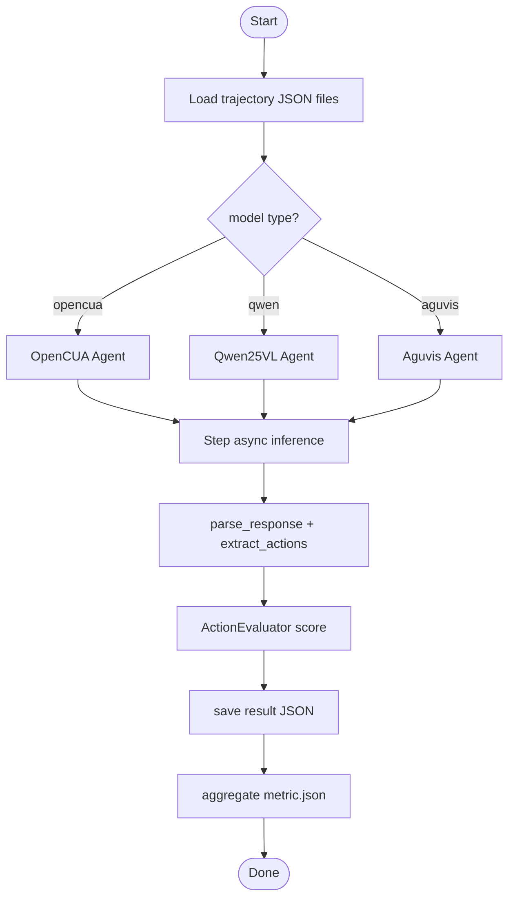
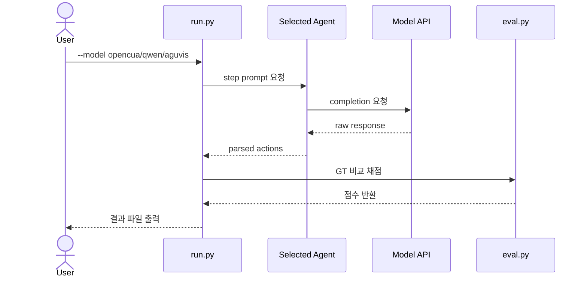
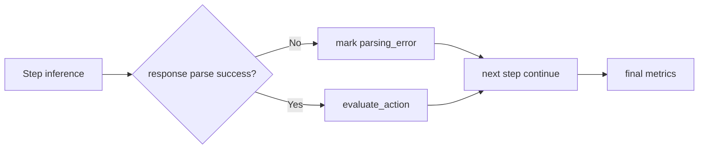

# 🔄 워크플로우

## 워크플로우가 뭔가요?

워크플로우는 "입력 데이터가 어떤 순서로 처리돼 결과 점수가 되는지"를 보여주는 실행 순서도입니다.

## 메인 워크플로우

아래는 `evaluation/agentnetbench/run.py` 기준 핵심 실행 흐름입니다.

## 에이전트 간 상호작용 흐름

실제 상호작용은 "에이전트끼리 협업"보다 "오케스트레이터가 하나를 선택"하는 구조입니다.

## 오류 처리 흐름

## 주요 시나리오별 흐름

- `run.py --model opencua`: OpenCUA 전용 히스토리/이미지 모드 파이프라인
- `run.py --model qwen2.5-vl-*`: `<tool_call>` 함수호출 파싱 파이프라인
- `reeval.py`: 모델 재호출 없이 기존 출력 JSON 재채점
