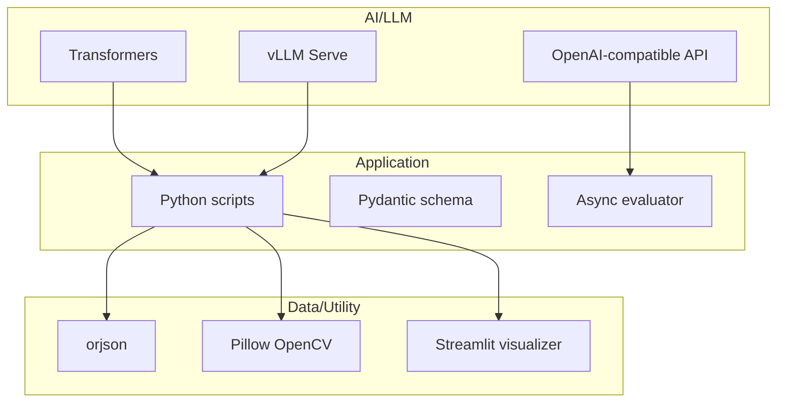
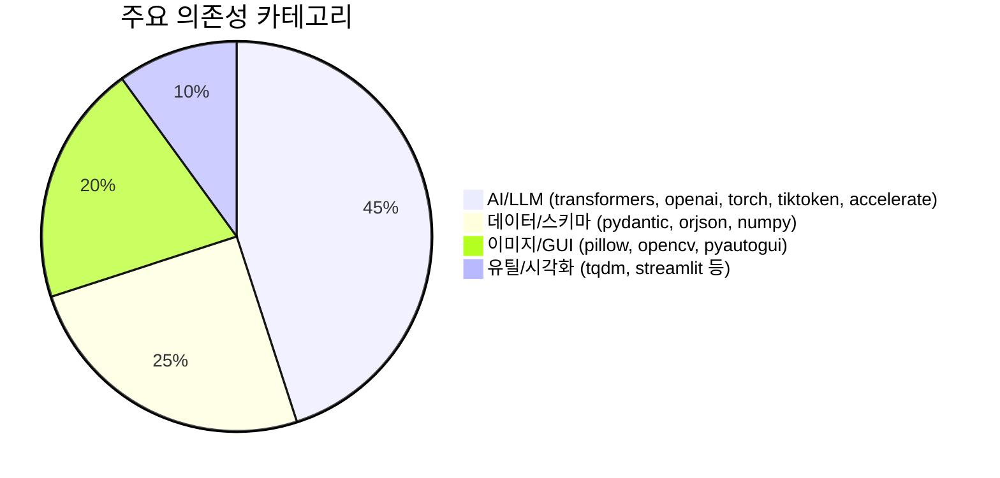

# 📦 기술 스택

## 기술 스택이 뭔가요?

이 프로젝트를 구성하는 언어, 라이브러리, 실행 환경의 조합입니다.

## 기술 스택 구성

아래 그림은 OpenCUA의 기술 계층을 단순화한 것입니다.

## 의존성 비중 (requirements 기준)

## 상세 스택

| 카테고리 | 기술/라이브러리 | 버전 | 용도 |
|---------|--------------|------|------|
| 언어/런타임 | Python | 3.10~3.12 문서 기준 | 전체 스크립트 실행 |
| LLM 호출 | `openai` | `>=1.0.0` | OpenAI 호환 API 호출 |
| 모델 추론 | `transformers`, `torch` | `4.53.0`, `2.8.0` | HF 로컬 추론 |
| 서빙 | `vllm` | `>=0.12.0` (문서 기준) | OpenAI 호환 모델 서빙 |
| 스키마 | `pydantic` | `>=2.8.2` | trajectory/action 검증 |
| 데이터 처리 | `orjson`, `numpy`, `tqdm` | `>=3.10.7`, `>=1.26.0`, `>=4.66.0` | 고속 JSON/수치 처리 |
| 이미지 처리 | `pillow`, `opencv-python` | `11.3.0`, `>=4.9.0` | 스크린샷/좌표 처리 |
| 시각화 | `streamlit`, `pandas` | 문서 기준 | trajectory 시각화 |
