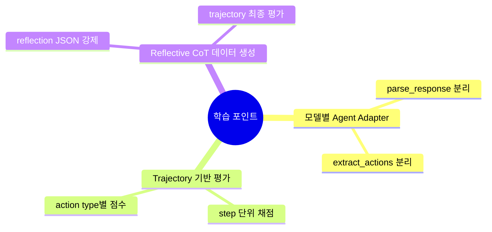

# 💡 핵심 인사이트 & 제안

## 잘 설계된 부분 👍

- 평가 파이프라인이 모델별 어댑터(`agent/*.py`)로 분리되어 확장성이 좋습니다.
- `eval.py`가 bbox 허용 판정, write+enter 병합 등 현실적인 채점 규칙을 포함합니다.
- `data-process -> cot-generate -> evaluation`로 데이터/평가 흐름이 명확히 분리돼 있습니다.
- OpenCUA 전용 옵션(`--opencua-l-number`, `--opencua-history`, `--opencua-image`)이 실험 축을 분명히 제공합니다.

## 주의해야 할 부분 ⚠️

- 레포 자체에는 온라인 실행 에이전트(실제 OS 조작 루프) 코드가 중심이 아니고, 평가/데이터 파이프라인 중심입니다.
- 의존성 파일이 분산(`model/requirement.txt`, `data/data-process/requirements.txt`)되어 재현환경 통합이 필요합니다.
- 일부 README 경로 표기(`cot-generator`, `data-processor`)와 실제 폴더(`cot-generate`, `data-process`)가 혼용되어 초심자 혼동 가능성이 있습니다.
- 비동기 평가에서 API 제한/타임아웃 관리가 중요하며, 대량 실행 시 재시도 정책 튜닝이 필요합니다.

## 초보자를 위한 학습 포인트 🎓

이 레포에서 배울 수 있는 에이전틱 패턴은 아래와 같습니다.

## 개선 제안 🚀

| 우선순위 | 제안 | 기대 효과 |
|---------|------|---------|
| 높음 | 루트 레벨 통합 환경 파일(`environment.yml` 또는 `pyproject.toml`) 제공 | 재현성 향상, 초기 셋업 시간 단축 |
| 높음 | 프롬프트/액션 스키마를 문서와 코드에서 단일 소스로 관리 | 파싱 오류와 문서 불일치 감소 |
| 중간 | 에이전트 공통 파싱 유틸 추출(`click/write/hotkey` 중복 제거) | 유지보수성 향상 |
| 중간 | 평가 결과 리포트(HTML/대시보드) 자동 생성 | 실험 비교 생산성 향상 |
| 낮음 | README 경로/명칭 정합성 정리 | 초보자 온보딩 개선 |
