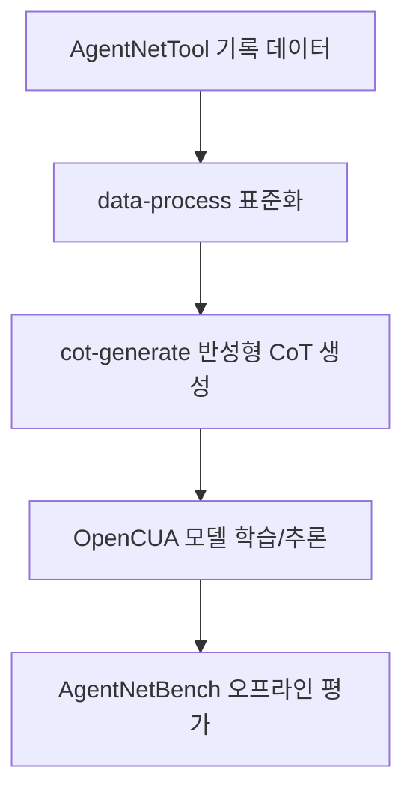

# 🔍 OpenCUA 분석 보고서

> **한 줄 요약**: OpenCUA는 "컴퓨터를 직접 조작하는 AI"를 만들기 위해 데이터(AgentNet)·모델(OpenCUA)·평가기(AgentNetBench)를 함께 제공하는 오픈 프레임워크입니다.
> 분석일: 2026-03-03 | 레포: https://github.com/xlang-ai/OpenCUA | 커밋: `65f7348`

## 📚 이 보고서 읽는 순서

처음 보는 분은 이 순서대로 읽으세요:

| 순서 | 파일 | 내용 | 소요 시간 |
|------|------|------|----------|
| 1 | [00_overview](./00_overview/summary.md) | 전체 그림 파악 | 5분 |
| 2 | [01_architecture](./01_architecture/architecture.md) | 시스템 구조 | 10분 |
| 3 | [02_agents](./02_agents/agents.md) | AI 에이전트들 | 10분 |
| 4 | [03_prompts](./03_prompts/prompts.md) | 프롬프트 설계 | 15분 |
| 5 | [04_tools](./04_tools/tools.md) | 사용 가능한 도구들 | 10분 |
| 6 | [05_workflows](./05_workflows/workflows.md) | 실제 동작 흐름 | 15분 |
| 7 | [06_techstack](./06_techstack/techstack.md) | 기술 스택 | 5분 |
| 8 | [07_insights](./07_insights/insights.md) | 인사이트 & 제안 | 10분 |

## 🗺️ 전체 구조 한눈에 보기

아래 그림은 OpenCUA 레포의 핵심 축(데이터 생성 -> 모델 추론 -> 오프라인 평가)을 단순화한 것입니다.

## 📊 주요 수치

| 항목 | 수치 |
|------|------|
| 총 파일 수 | 152개 (`.git`/`node_modules` 제외) |
| 에이전트 수 | 3개 (`OpenCUA`, `Qwen25VL`, `Aguvis`) |
| 프롬프트 파일 수 | 0개 (파일명 기준) / 19개+ (코드 상수 기준) |
| 정의된 툴/액션 인터페이스 | 13개 (GUI 11 + `computer.terminate` + `computer.triple_click`) |
| 사용 AI 프레임워크 | `openai` SDK, `transformers`, `vLLM`(서빙), `pydantic` |

## ✅ 분석 범위

- 평가 런타임: `evaluation/agentnetbench/*`
- 모델 추론 예제: `model/inference/*`
- CoT 생성 파이프라인: `data/cot-generate/*`
- 데이터 표준화 파이프라인: `data/data-process/*`
- 시크릿: API 키는 환경변수(`API_KEY`) 사용만 확인했으며 실제 값은 문서화하지 않음
