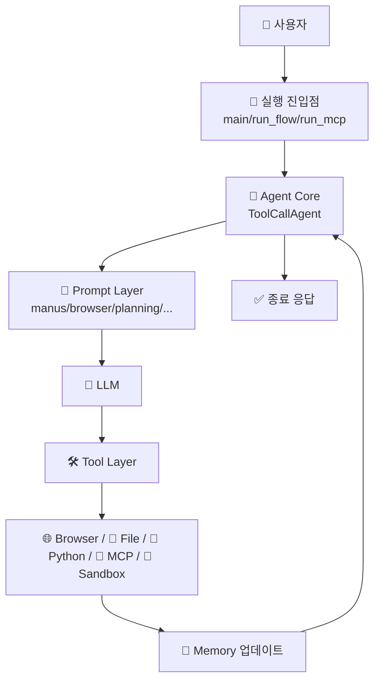

# 📖 이 시스템은 무엇인가요?

## 쉬운 설명

OpenManus는 "AI 작업팀"입니다.

- 간단한 요청이면 `Manus` 한 명이 직접 처리합니다.
- 복잡한 요청이면 `PlanningFlow`가 먼저 "할 일 목록(Plan)"을 만들고, 단계별로 executor를 고릅니다.
- 웹 탐색, 코드 실행, 파일 수정, 검색, 외부 MCP 도구 호출까지 한 루프에서 처리합니다.
- 그래서 구조는 "범용 1개만"이 아니라, **범용(`Manus`) + 특화 에이전트 조합**으로 이해하는 것이 정확합니다.
- 범용은 커버리지를 담당하고, 특화는 정확도/안정성/안전성(격리 실행)을 담당합니다.

즉, "질문 답변 모델"이 아니라 "실행형 에이전트 런타임"에 가깝습니다.

## 이 시스템이 하는 일

사용자 입장에서 보면 보통 다음 순서입니다.

1. 사용자 요청 입력 (`main.py`, `run_flow.py`, `run_mcp.py`)
2. 에이전트가 프롬프트+메모리를 합쳐 다음 행동을 결정
3. 툴 호출 (`browser_use`, `python_execute`, `str_replace_editor`, `planning`, `mcp` 등)
4. 결과를 메모리에 저장하고 다음 스텝 판단
5. `terminate` 또는 플랜 완료 시 종료

## 자주 헷갈리는 포인트 (핵심)

1. "태그 기반 최소 라우팅도 라우팅인가?"
   - 네, **기능적으로 라우팅**입니다.
2. "OpenManus가 멀티 에이전트인가?"
   - `run_flow.py` 경로에서는 멀티 에이전트로 볼 수 있습니다.
   - `main.py` 기본 경로는 단일 에이전트(`Manus`)입니다.
3. "Browser/SWE/MCP까지 자동으로 다 고르나?"
   - 기본 설정에서는 아닙니다.
   - 기본 `run_flow`는 `manus` + 옵션 `data_analysis` 중심입니다.

## 전체 구조 다이어그램

아래 그림은 OpenManus의 전체 큰 흐름입니다.



## 디렉토리 구조

각 폴더의 역할은 아래와 같습니다.

```text
OpenManus/
├── app/
│   ├── agent/          ← 에이전트 클래스(Manus, Browser, MCP, SWE, Sandbox)
│   ├── flow/           ← PlanningFlow 기반 오케스트레이션
│   ├── prompt/         ← 시스템/다음스텝 프롬프트 템플릿
│   ├── tool/           ← 실행 가능한 툴 정의 및 스키마
│   ├── sandbox/        ← Docker 기반 샌드박스 클라이언트
│   ├── daytona/        ← Daytona 샌드박스 연동
│   ├── llm.py          ← LLM 호출 래퍼(OpenAI/Azure/AWS Bedrock)
│   └── config.py       ← TOML 설정 로더
├── config/             ← 모델/브라우저/MCP 예제 설정
├── protocol/a2a/       ← A2A 프로토콜 서버 연동
├── main.py             ← 기본 Manus 실행 엔트리
├── run_flow.py         ← PlanningFlow 실행 엔트리
├── run_mcp.py          ← MCPAgent 실행 엔트리
└── sandbox_main.py     ← SandboxManus 실행 엔트리
```

## 핵심 용어 설명

| 용어 | 쉬운 설명 |
|------|----------|
| 에이전트 (Agent) | 일을 수행하는 AI 담당자 |
| ToolCallAgent | "생각(LLM) → 도구 호출" 루프를 수행하는 핵심 베이스 클래스 |
| 프롬프트 (Prompt) | 에이전트 행동 규칙/지침 문서 |
| PlanningFlow | 큰 일을 여러 단계로 쪼개고 순차 실행하는 플로우 |
| MCP | 외부 도구 서버와 연결해 도구를 동적으로 추가하는 프로토콜 |
| Sandbox | 코드/브라우저를 격리 환경에서 실행하는 안전 장치 |
| terminate 툴 | "여기서 작업 종료"를 명시하는 종료 신호 |
