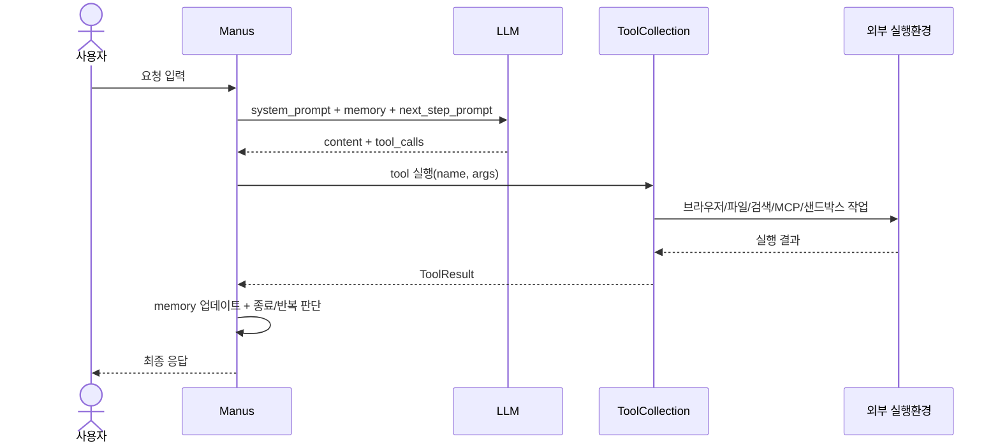
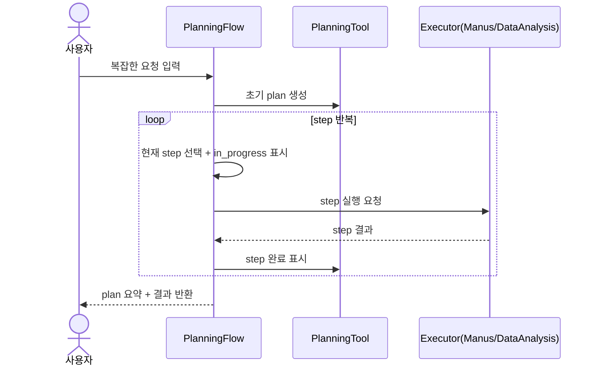

# 🏗️ 시스템 아키텍처

## 아키텍처란?

아키텍처는 "이 시스템이 어떤 부품으로 이루어져 있고, 어떻게 연결되는지"를 보여주는 설계도입니다.

OpenManus는 **에이전트 코어 + 프롬프트 + 툴 + 실행환경** 네 층으로 구성됩니다.

## 현재 구현 상태 (중요)

OpenManus는 역할별 에이전트가 여럿 정의되어 있지만, 실제 실행은 **엔트리포인트별 모드 분기**로 동작합니다.

| 모드 | 엔트리포인트 | 실제 코어 | 활성 에이전트 |
|---|---|---|---|
| 기본 단일 실행 | `main.py` | `ToolCallAgent` 루프 | `Manus` |
| 플래닝 실행 | `run_flow.py` | `PlanningFlow` + `ToolCallAgent` | `manus` + (옵션) `data_analysis` |
| MCP 전용 실행 | `run_mcp.py` | `ToolCallAgent` 루프 | `MCPAgent` |
| 샌드박스 실행 | `sandbox_main.py` | `ToolCallAgent` 루프 | `SandboxManus` |
| A2A 서버 실행 | `protocol/a2a` | `Manus` 기반 래퍼 | `A2AManus` |

추가로 `BrowserAgent`, `SWEAgent`는 클래스는 정의되어 있지만, 기본 CLI 엔트리포인트에 직접 연결되어 있지 않아 확장/커스텀 경로에서 활용하는 성격에 가깝습니다.

## 전체 컴포넌트 구조 (코드 기준)

이 그림은 핵심 컴포넌트 관계를 보여줍니다.

```mermaid
graph TD
    subgraph Entry[엔트리포인트]
        E1[main.py]
        E2[run_flow.py]
        E3[run_mcp.py]
        E4[sandbox_main.py]
        E5[protocol/a2a]
    end

    subgraph Core[코어 레이어]
        TCA[ToolCallAgent 공통 루프]
        PF[PlanningFlow]

        M[Manus]
        DA[DataAnalysis (optional)]
        MCP[MCPAgent]
        SM[SandboxManus]
        A2AM[A2AManus]
        BA[BrowserAgent (정의됨)]
        SWE[SWEAgent (정의됨)]
    end

    subgraph Prompt[프롬프트 레이어]
        P1[manus/browser/mcp/swe/visualization]
        P2[planning]
    end

    subgraph Tools[툴 레이어(대표)]
        TT1[python_execute / browser_use / str_replace_editor]
        TT2[planning]
        TT3[MCPClientTool]
        TT4[sandbox_*]
        TT5[bash / visualization / terminate]
    end

    subgraph Infra[실행 레이어]
        I1[LLM API]
        I2[브라우저/Playwright]
        I3[파일시스템]
        I4[MCP 서버]
        I5[Docker/Daytona Sandbox]
    end

    E1 --> M
    E2 --> PF
    PF --> M
    PF -. 옵션 .-> DA
    E3 --> MCP
    E4 --> SM
    E5 --> A2AM
    A2AM --> M

    M --> TCA
    DA --> TCA
    MCP --> TCA
    SM --> TCA
    BA --> TCA
    SWE --> TCA

    PF --> P2
    TCA --> P1

    TCA --> TT1
    PF --> TT2
    TCA --> TT3
    TCA --> TT4
    TCA --> TT5

    TCA --> I1
    TT1 --> I2
    TT1 --> I3
    TT3 --> I4
    TT4 --> I5
```

## 모드별 데이터 흐름

### 1) 기본 단일 실행 (`main.py`)



### 2) 플래닝 실행 (`run_flow.py`)



### 2-1) `run_flow` 라우팅 규칙(실제 구현)

`PlanningFlow`는 step 문장에서 태그를 읽어 executor를 고릅니다.

1. 플래너가 step 목록 생성
2. 각 step에서 `[TAG]` 패턴 추출
3. `TAG`를 소문자로 바꿔 `step_type`으로 사용
4. `step_type`이 에이전트 key와 같으면 해당 executor 선택, 아니면 기본 executor로 fallback

즉, **태그 기반 최소 라우팅이지만 기능적으로는 통합 라우팅**입니다.

### 3) 특화 실행 (`run_mcp.py`, `sandbox_main.py`)

- `run_mcp.py`: `MCPAgent`가 MCP 서버 연결 후 해당 도구만 중심으로 실행합니다.
- `sandbox_main.py`: `SandboxManus`가 sandbox 전용 도구(`sandbox_browser/files/shell/vision`)를 활성화해 실행합니다.

## 계층별 설명 (현행 코드 기준)

1. **입력 레이어**: `main.py`, `run_flow.py`, `run_mcp.py`, `sandbox_main.py`, `protocol/a2a`에서 요청을 받습니다.
2. **코어 레이어**:
   - 공통 루프는 `ToolCallAgent(think -> tool_calls -> act)`입니다.
   - `PlanningFlow`는 `run_flow.py`에서만 사용되며, step 상태/실행자 선택을 담당합니다.
   - `BrowserAgent`, `SWEAgent`는 정의는 되어 있으나 기본 CLI 경로에 직접 연결되지는 않습니다.
3. **프롬프트 레이어**: 에이전트 역할별 시스템 규칙과 다음 행동 지시를 제공합니다.
4. **툴 레이어**:
   - `Manus`: `python_execute`, `browser_use`, `str_replace_editor`, `ask_human`, `terminate`
   - `DataAnalysis`: 시각화/분석 툴 세트
   - `MCPAgent`: MCP 서버에서 받은 동적 툴
   - `SandboxManus`: `sandbox_*` 툴 세트
5. **실행 레이어**: API/브라우저/파일/MCP/Sandbox 같은 외부 자원을 실제로 사용합니다.

## 해석 포인트

1. "에이전트가 많다"와 "기본 실행에서 모두 동시 사용"은 다릅니다.
2. 현재 OpenManus는 `모드 분기형 아키텍처`에 가깝고, `run_flow.py` 경로에서는 **통합 라우팅(태그 기반, 범위 제한)**이 구현되어 있습니다.
3. 따라서 아키텍처를 읽을 때는 "정의된 컴포넌트 목록"보다 "엔트리포인트에 실제 연결된 경로"를 우선해서 보는 것이 정확합니다.
