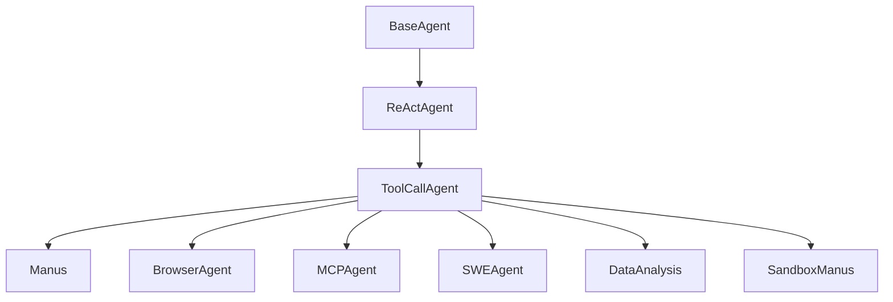

# 🤖 에이전트 구성

## 에이전트가 뭔가요?

에이전트는 "한 가지 성격과 도구 세트를 가진 AI 작업자"입니다.
OpenManus는 공통 베이스(`ToolCallAgent`) 위에 역할별 에이전트를 얹는 구조입니다.

## 왜 범용 `Manus`만으로 안 하고 특화 에이전트를 두나요?

짧게 말하면, 범용은 "폭넓게 처리"에 강하고 특화는 "안정적으로 정확히 처리"에 강합니다.

| 관점 | 범용 `Manus`만 사용 | 특화 에이전트 분리 |
|---|---|---|
| 커버리지 | 넓음 | 작업별로 명확히 분리 |
| 정확도 | 작업 종류가 섞이면 흔들릴 수 있음 | 도메인별 프롬프트/툴로 품질 안정 |
| 실패 대응 | 실패 유형이 뒤섞임 | 브라우저/MCP/코드/샌드박스별로 대응 가능 |
| 안전성 | 권한/실행 환경 통제가 상대적으로 거침 | 샌드박스처럼 강한 격리 적용 쉬움 |
| 운영성 | 로그/정책/튜닝이 한 덩어리 | 모드별 관찰/튜닝/운영이 쉬움 |

실무 해석:
1. 기본 작업은 `Manus`로 빠르게 처리
2. 복잡 작업은 `run_flow`에서 step별 executor 선택(태그 기반 라우팅)
3. 고위험/특수 작업은 `MCPAgent`, `SandboxManus`, `SWEAgent` 같은 특화 경로 사용

## 먼저 정리: "정의"와 "실행 연결"은 다릅니다

| 에이전트 | 클래스 정의 | 기본 엔트리포인트 연결 | `run_flow` 기본 라우팅 대상 |
|---|---|---|---|
| Manus | O | O (`main.py`) | O |
| DataAnalysis | O | X (옵션) | O (옵션 켜면) |
| MCPAgent | O | O (`run_mcp.py`) | X (기본 설정) |
| SandboxManus | O | O (`sandbox_main.py`) | X (기본 설정) |
| BrowserAgent | O | X | X |
| SWEAgent | O | X | X |

해석 포인트:
- 위 표에서 `run_flow` 라우팅은 **태그 기반 최소 라우팅**입니다.
- 최소 라우팅이라도 기능적으로는 라우팅으로 보는 것이 맞습니다.

## 에이전트 관계도

아래 그림은 핵심 상속/역할 관계입니다.

## 에이전트별 상세 설명

### Manus
- **역할**: 기본 범용 실행 에이전트
- **파일 위치**: `app/agent/manus.py`
- **담당 업무**:
  - Python 실행/브라우저 자동화/파일 수정/사람 질의/종료 처리
  - MCP 서버에 연결되면 외부 툴을 동적으로 합류
  - 최근 메시지에서 브라우저 사용 흔적이 보이면 브라우저 상태 기반 프롬프트로 전환
- **사용하는 모델**: `app/llm.py` 설정 기반 (OpenAI/Azure/AWS 등)
- **기본 툴**: `python_execute`, `browser_use`, `str_replace_editor`, `ask_human`, `terminate`

### BrowserAgent
- **역할**: 브라우저 전용 자동화 에이전트
- **파일 위치**: `app/agent/browser.py`
- **특징**:
  - 각 스텝마다 현재 URL/탭/화면 상태를 읽어 `NEXT_STEP_PROMPT`를 동적으로 생성
  - 스크린샷(base64)을 메모리에 넣어 멀티모달 판단 지원
- **기본 툴**: `browser_use`, `terminate`

### MCPAgent
- **역할**: MCP 서버 도구를 사용하는 동적 에이전트
- **파일 위치**: `app/agent/mcp.py`
- **특징**:
  - `stdio`/`sse` 연결 방식 지원
  - 일정 스텝마다 도구 목록 새로고침(도구 추가/삭제 감지)
  - 도구가 사라지면 안전하게 종료

### SWEAgent
- **역할**: 코드 수정/셸 작업 중심 에이전트
- **파일 위치**: `app/agent/swe.py`
- **기본 툴**: `bash`, `str_replace_editor`, `terminate`

### DataAnalysis
- **역할**: 데이터 분석/시각화 전용 에이전트
- **파일 위치**: `app/agent/data_analysis.py`
- **기본 툴**: `NormalPythonExecute`, `VisualizationPrepare`, `DataVisualization`, `terminate`

### SandboxManus
- **역할**: 격리 환경(daytona sandbox) 중심의 범용 에이전트
- **파일 위치**: `app/agent/sandbox_agent.py`
- **특징**:
  - 샌드박스 생성 후 `sandbox_browser/files/shell/vision` 툴 활성화
  - 종료 시 샌드박스와 MCP 연결 정리

## 에이전트 역할 분담표

| 에이전트 | 역할 한 줄 요약 | 입력 | 출력 | 주로 쓰는 툴 |
|---------|--------------|------|------|---------|
| Manus | 기본 범용 실행기 | 사용자 요청 | 단계별 실행 로그/결과 | python, browser, editor, mcp |
| BrowserAgent | 웹 UI 자동화 | 웹 작업 지시 | 페이지 조작 결과 | browser_use |
| MCPAgent | 외부 도구 서버 연동 | MCP 작업 지시 | MCP 도구 결과 | MCPClientTool |
| SWEAgent | 코드/CLI 작업 | 개발 요청 | 파일/명령 실행 결과 | bash, str_replace_editor |
| DataAnalysis | 분석/시각화 | 데이터 분석 요청 | 차트/리포트 결과 | visualization 툴 |
| SandboxManus | 격리 실행 | 보안/격리 필요 작업 | 샌드박스 내 실행 결과 | sandbox_* |

## 초보자 포인트

- OpenManus는 "에이전트가 여러 개"라기보다, **ToolCallAgent라는 공통 엔진을 역할별로 세팅**한 구조입니다.
- 그래서 확장할 때는 새 에이전트를 처음부터 만들기보다, ToolCallAgent + Prompt + ToolCollection 조합으로 빠르게 추가할 수 있습니다.
- `run_flow` 기준으로는 "여러 executor를 하나의 플로우가 고른다"는 의미에서 통합 라우팅(초기형)으로 이해하면 됩니다.
