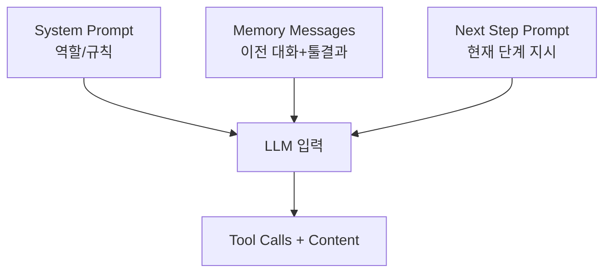
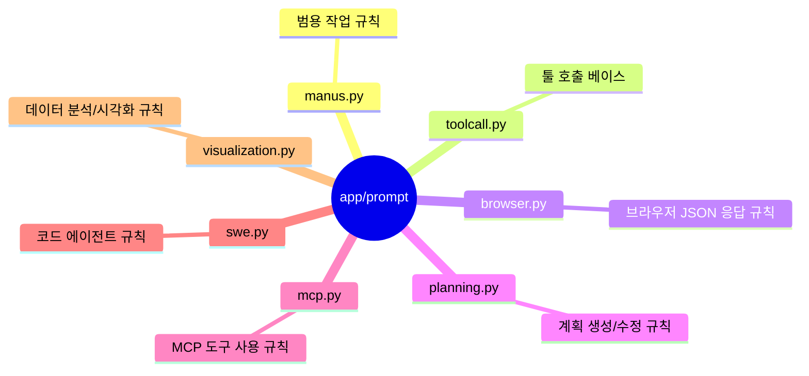
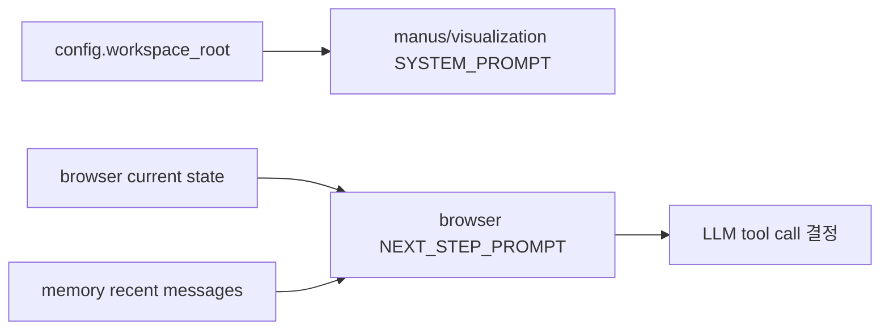

# 📝 프롬프트 분석

## 프롬프트가 뭔가요?

프롬프트는 에이전트의 "행동 매뉴얼"입니다.
OpenManus는 역할별로 프롬프트를 분리해 재사용합니다.

## 프롬프트 구조 개요

이 그림은 OpenManus 프롬프트가 실제 추론에 들어가는 구조를 보여줍니다.

## 발견된 프롬프트 목록

## 프롬프트별 상세 분석

### `app/prompt/manus.py`
- **용도**: 기본 Manus 에이전트의 범용 행동 규칙
- **구조**:
  - `SYSTEM_PROMPT`: "all-capable assistant" + 작업 디렉토리 주입 (`{directory}`)
  - `NEXT_STEP_PROMPT`: 적절한 툴을 선택하고 단계적으로 해결, 필요 시 `terminate`
- **핵심 포인트**: 도메인 고정이 아닌 범용 태스크 지향

### `app/prompt/browser.py`
- **용도**: 브라우저 조작용 고정 JSON 응답 포맷 강제
- **구조**:
  - 상호작용 가능한 요소 인덱스 기반 조작 규칙
  - `current_state`, `memory`, `next_goal`, `action[]` 강제 포맷
- **핵심 포인트**: 브라우저 작업의 "행동 일관성" 확보

### `app/prompt/planning.py`
- **용도**: 계획 수립/수정/완료 판단 품질 강화
- **구조**:
  - 계획 도구(`planning`)와 `finish` 중심 지시
  - 지나친 세분화를 피하고 실행 가능한 단계에 집중
- **핵심 포인트**: 긴 작업에서 경로 이탈을 줄임

### `app/prompt/mcp.py`
- **용도**: 동적으로 변하는 MCP 도구를 안전하게 사용
- **구조**:
  - 도구 스키마 확인 → 파라미터 검증 → 오류 복구 규칙
  - 멀티미디어 응답 처리 보조 프롬프트 포함
- **핵심 포인트**: 도구 목록 변동이 있는 환경 대응

### `app/prompt/swe.py`
- **용도**: 코드 편집/쉘 실행형 에이전트 운영 규칙
- **핵심 포인트**: "응답당 정확히 1개 툴 호출" 같은 강한 제약

### `app/prompt/visualization.py`
- **용도**: 데이터 분석 에이전트용 단계 지시
- **핵심 포인트**: 한 스텝 한 도구, 에러 시 수정 루프

## 템플릿 변수 흐름

아래는 대표 변수 주입 흐름입니다.

## 초보자 포인트

- OpenManus의 프롬프트는 "멋진 문장"보다 **실행 제약**에 집중합니다.
- 특히 `browser.py`와 `swe.py`는 출력 형식과 행동 단위를 강하게 제한해서 실패율을 줄입니다.
