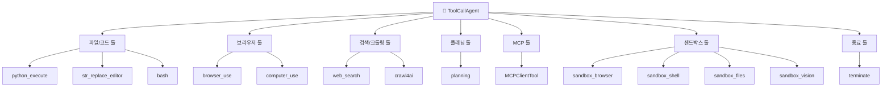
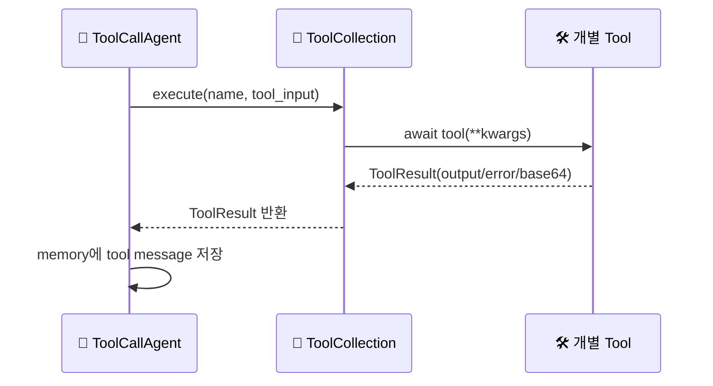

# 🛠️ 툴 & 함수

## 툴이 뭔가요?

툴은 에이전트가 "실제로 손발을 움직이는 방법"입니다.
LLM은 어떤 툴을 쓸지 결정하고, ToolCollection이 실제 파이썬 코드를 실행합니다.

## 툴 전체 맵

이 그림은 OpenManus에서 자주 쓰는 툴 그룹을 보여줍니다.

## 툴 호출 흐름

## 주요 툴 목록

| 툴 이름 | 카테고리 | 설명 | 파일 위치 |
|---------|---------|------|---------|
| `python_execute` | 코드 실행 | 파이썬 코드 실행 | `app/tool/python_execute.py` |
| `str_replace_editor` | 파일 수정 | 파일 보기/치환/생성 등 | `app/tool/str_replace_editor.py` |
| `bash` | CLI | 셸 명령 실행 | `app/tool/bash.py` |
| `browser_use` | 브라우저 | URL 이동/클릭/입력/스크롤/추출 | `app/tool/browser_use_tool.py` |
| `web_search` | 검색 | 다중 검색엔진 fallback 검색 | `app/tool/web_search.py` |
| `crawl4ai` | 크롤링 | 웹페이지 텍스트 추출 | `app/tool/crawl4ai.py` |
| `planning` | 계획 | create/update/mark_step 등 계획 관리 | `app/tool/planning.py` |
| `create_chat_completion` | LLM 호출 | 모델 직접 호출형 툴 | `app/tool/create_chat_completion.py` |
| `terminate` | 종료 | 에이전트 실행 종료 | `app/tool/terminate.py` |
| `ask_human` | 인간 질의 | 사람이 추가 입력 제공 | `app/tool/ask_human.py` |
| `sandbox_browser` | 샌드박스 | 격리 브라우저 조작 | `app/tool/sandbox/sb_browser_tool.py` |
| `sandbox_shell` | 샌드박스 | 세션 기반 shell 실행 | `app/tool/sandbox/sb_shell_tool.py` |
| `sandbox_files` | 샌드박스 | 파일 업/다운로드/조작 | `app/tool/sandbox/sb_files_tool.py` |
| `sandbox_vision` | 샌드박스 | 시각 정보 처리 | `app/tool/sandbox/sb_vision_tool.py` |

## 툴별 특징(초보자 관점)

1. `planning` 툴은 단순 TODO 리스트가 아니라 step 상태(`not_started/in_progress/completed/blocked`)를 추적합니다.
2. `web_search`는 한 엔진 실패 시 다른 엔진으로 자동 전환합니다.
3. `browser_use`는 상태를 유지하는 세션형 툴이라, 연속 동작에 유리합니다.
4. `terminate`는 종료 조건을 명시적으로 LLM에게 맡기는 핵심 제어점입니다.
