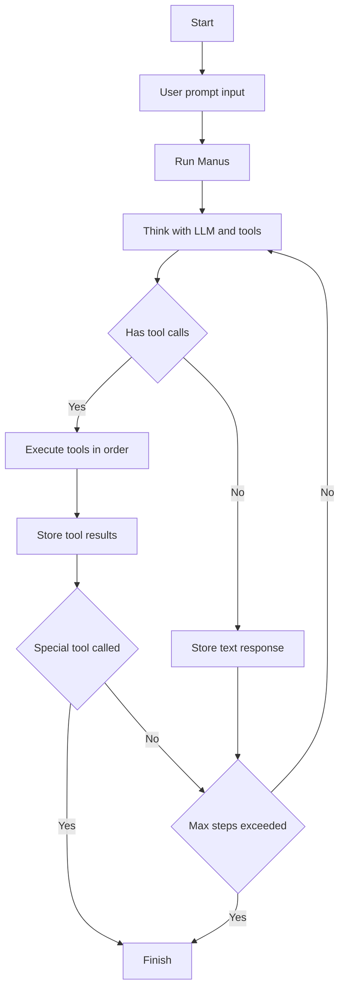
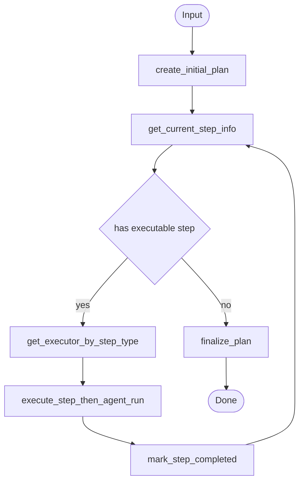
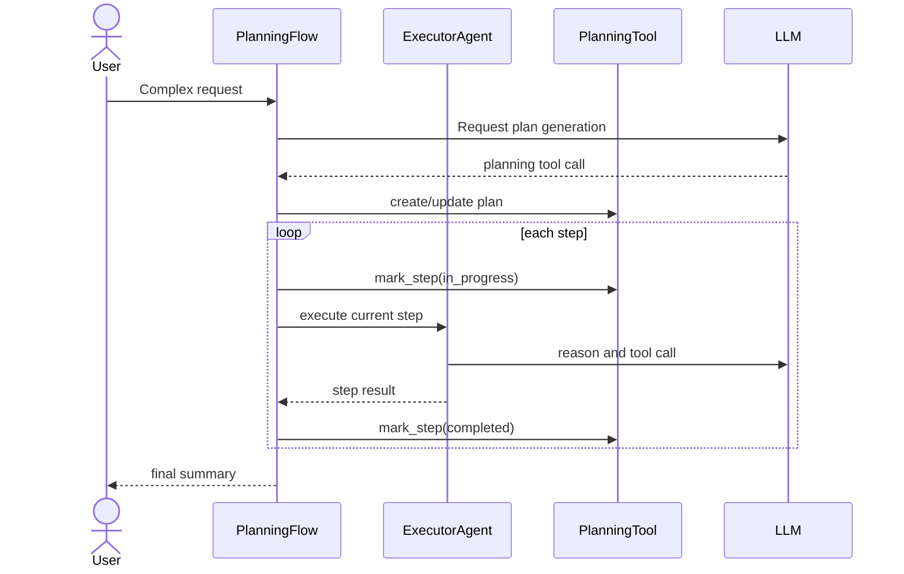
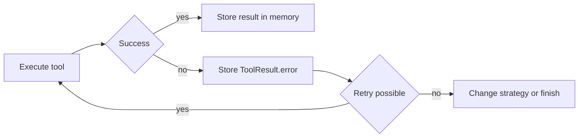

# 🔄 워크플로우

## 워크플로우가 뭔가요?

워크플로우는 "요청이 어떤 단계로 처리되는지"를 보여주는 순서도입니다.
OpenManus는 실행 경로가 4가지로 나뉩니다.

- 기본 단일 에이전트: `main.py -> Manus`
- 플래닝 멀티에이전트: `run_flow.py -> PlanningFlow`
- MCP 전용: `run_mcp.py -> MCPAgent`
- 샌드박스 모드: `sandbox_main.py -> SandboxManus`

## 메인 워크플로우 (Manus)

아래 그림은 기본 루프입니다.

## PlanningFlow 워크플로우

이 그림은 `run_flow.py` 경로에서의 단계 분해 흐름입니다.

## `run_flow` 라우팅을 아주 쉽게 보면

`PlanningFlow`는 "현재 step을 누구에게 맡길지"를 아래 규칙으로 고릅니다.

1. step 문자열에서 `[TAG]`를 찾습니다.
2. `TAG`를 소문자로 바꿔 `step_type`으로 사용합니다.
3. `step_type`이 에이전트 key와 같으면 그 에이전트를 실행합니다.
4. 못 찾으면 기본 executor(보통 `manus`)로 fallback합니다.

예시:
- step: `[DATA_ANALYSIS] 매출 추세 그래프 작성`
- 선택: `data_analysis` executor
- step에 태그가 없거나 매칭 실패 시: `manus`

즉, **태그 기반 최소 라우팅이지만 실제로 executor를 고르는 라우팅 기능**입니다.

주의:
- 현재 태그 파서는 `[A-Z_]` 패턴을 기대하므로, 태그 형식이 어긋나면 기본 executor fallback이 발생할 수 있습니다.

## 에이전트 간 상호작용 흐름

## 오류 처리 흐름

## 초보자 핵심 정리

1. OpenManus의 핵심은 "한 번에 정답"이 아니라 "스텝 반복"입니다.
2. `PlanningFlow`는 큰 작업에서 방향을 잃지 않게 해주는 관리자 역할입니다.
3. `run_flow`에서는 태그 기반으로 executor를 고르는 통합 라우팅(초기형)이 동작합니다.
4. 종료는 보통 `terminate` 툴 호출 또는 plan step 소진으로 결정됩니다.
